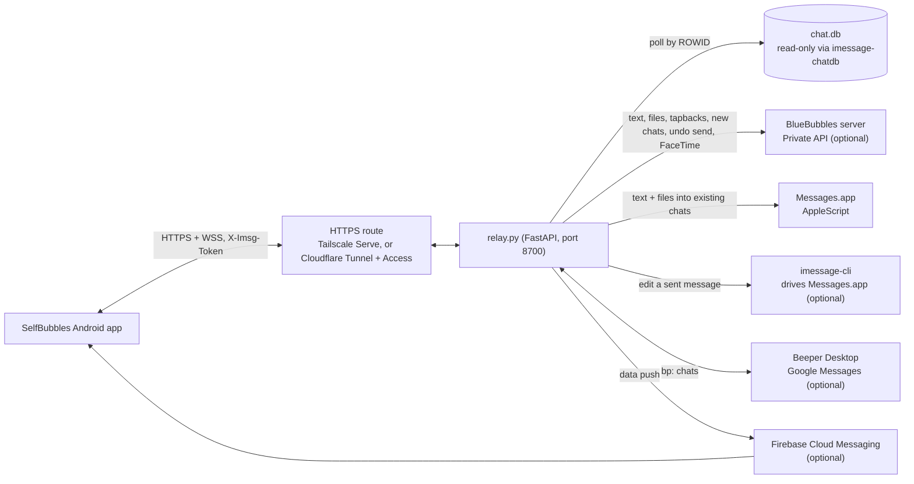

# SelfBubbles relay

[](https://github.com/Avtraang/selfbubbles-relay/actions/workflows/ci.yml)

The Mac-side half of [SelfBubbles](https://github.com/Avtraang/selfbubbles): a small FastAPI service that runs on a Mac signed into Messages, reads the Messages database through [imessage-chatdb](https://github.com/Avtraang/imessage-chatdb), sends through a chain of engines (BlueBubbles Private API, Messages.app over AppleScript, Beeper Desktop for Google Messages), pushes new messages to the Android app over WebSocket and FCM, and serves attachments, thumbnails and link previews. Optional extras: Google Messages threads merged into the same inbox, a FaceTime relay, a Home Assistant map, translation and a voice-assistant endpoint.

SelfBubbles is an independent, personal project. It is not affiliated with, endorsed by or supported by BlueBubbles, Beeper, Apple, Google or Cloudflare. It can use the BlueBubbles server's HTTP API as one optional sending engine and Beeper Desktop for Google Messages. iMessage, FaceTime and Messages are trademarks of Apple Inc.; Google Messages is a trademark of Google LLC.

Built with an AI assistant (Claude Code) and used daily by the author since July 2026. The relay has no screen of its own. Screenshots, when they are added, will live in the [app repository](https://github.com/Avtraang/selfbubbles) and will be generated from a synthetic database ([`tools/make_demo_db.py`](tools/make_demo_db.py)), never from real conversations.

## Contents

- [What it does](#what-it-does)
- [Architecture](#architecture)
- [Requirements](#requirements)
- [What each feature needs](#what-each-feature-needs)
- [Install](#install)
- [The doctor table](#the-doctor-table)
- [macOS Local Network privacy](#macos-local-network-privacy)
- [Send engines](#send-engines)
- [Edit and Undo Send](#edit-and-undo-send)
- [Configuration reference](#configuration-reference)
- [Exposing the relay to the phone](#exposing-the-relay-to-the-phone)
- [HTTP API](#http-api)
- [Logs and privacy](#logs-and-privacy)
- [FaceTime bridge](#facetime-bridge)
- [Tests](#tests)
- [Known limits](#known-limits)
- [Licence](#licence)

## What it does

- **Receive.** Polls `~/Library/Messages/chat.db` every `IMSG_POLL_SECONDS` (default 2) by monotonic ROWID, read-only, through the `imessage-chatdb` library. Edits are picked up from `date_edited`. A rebuilt database (ROWIDs restarting) is detected and the cursor re-seats itself at "now".
- **Fan out.** Every new or edited message is broadcast to connected WebSocket clients (`{"type":"message"|"update","data":{...}}`). When `FCM_CREDS` names a Firebase service-account file, incoming messages also go out as data-only FCM pushes (chat, sender, text, first image), so the phone is notified while the app is closed. That needs an app built with the same Firebase project's `google-services.json`; without FCM the phone learns of new messages only while the app is open. Archived chats are not pushed.
- **Send.** `/send`, `/send_attachment`, `/react` and `/create_chat` walk an ordered chain of engines; the first that succeeds wins. Without a BlueBubbles password the chain is AppleScript alone and plain texts and files still go out into existing chats. (`.env.example` ships `BB_PASSWORD` commented out, so a literal copy gives exactly that chain; see [Install](#install).)
- **Edit and Undo Send.** `/edit` and `/unsend` change one of your own recent iMessages, within Apple's limits. Two different engines do the work, and the relay answers only after `chat.db` shows the change; see [Edit and Undo Send](#edit-and-undo-send).
- **Serve media.** Attachments straight from disk, with on-the-fly conversion of iPhone HEIC to JPEG and `.caf` voice notes to M4A (cached beside the relay); Quick Look thumbnails for anything else; the preview image Apple embeds in link payloads; Apple News links resolved in the background to the publisher article for a picture and summary.
- **Names.** Resolved from the BlueBubbles Contacts endpoint when a password is set; otherwise raw handles.
- **Relay-side state.** Pins, pin order, archive, manual unread, per-chat auto-translate, read marks and push tokens live in `relay_state.json`, never in Messages.
- **Optional.** Google Messages threads via Beeper Desktop (`bp:` chat guids, text + replies, live WebSocket events); FaceTime ring, answer and link minting via BlueBubbles (the phone still has to be let into the call from the Mac; see [FaceTime bridge](#facetime-bridge)); a MapKit page fed by Home Assistant trackers (not in the author's daily use; see [Known limits](#known-limits)); Latin-script translation through a MarianMT service and everything else through Ollama; a voice-assistant flow that resolves fuzzy recipient names and confirms out loud before sending.

## Architecture



Everything runs on the one Mac except the phone and, if you use them, Firebase, Home Assistant and your HTTPS route. BlueBubbles and Beeper Desktop are separate processes reached over localhost; nothing links against them. `imessage-cli` is a command-line program the relay starts once per edit. The only requests the relay sends to the internet without being configured for an integration are Apple News link previews (on by default; `APPLE_NEWS_PREVIEWS=0` turns them off).

## Requirements

The honest list. Each line is something the relay cannot work around.

- **A Mac that stays on, awake and logged in**, signed into Messages with the Apple Account whose conversations you want. The relay reads that Mac's `chat.db`; there is no other source. Nothing here works without a Mac that is signed into Messages. Run as a LaunchAgent (the documented way), the relay lives inside a logged-in desktop session: after a reboot nothing runs until that user logs in, and a sleeping Mac answers nothing.
- **Messages in iCloud OFF** on that Mac (`defaults read com.apple.madrid CloudKitSyncingEnabled` should print `0`). The switch is under System Settings > your Apple Account > iCloud > Messages in iCloud; menu wording moves between macOS releases, so the `defaults` line is the check that counts. With it on, new messages can stop landing in the local `chat.db` that the relay polls, and older attachments can be evicted to the cloud, which the relay reports as `404 file missing on disk`. The author saw sign-ins and macOS updates silently switch it back on, so re-check after an update.
- **Full Disk Access for the Python that runs the relay.** `chat.db` is protected by macOS's privacy controls (TCC). The grant goes to the real binary behind `venv/bin/python` (a symlink): when the database is not readable, `relay.py --check` prints the exact path to add under System Settings > Privacy & Security > Full Disk Access, in the form `grant Full Disk Access to <venv python> (resolves to <real binary>)`. Three things to know:
  - The grant is tied to that exact file. With Homebrew's Python the real binary sits in a versioned `Cellar` directory, so an upgrade that moves Python orphans the grant and the row returns to `NOT READABLE`. Re-run `relay.py --check` after any Python upgrade.
  - Run from Terminal, `--check` can inherit Terminal's own access, so `readable` there does not prove the LaunchAgent can read the database: after `launchctl bootstrap`, read the `chat.db` row of the newest doctor table in `relay.log`. The reverse also happens: if the row stays `NOT READABLE` in Terminal after you granted Python, grant the terminal app as well for manual runs.
  - These steps follow the doctor's code and macOS's documented behaviour. They have not been walked through on a Mac with SIP on; see "Tested configuration" under [Known limits](#known-limits).
- **macOS 26 or 27.** The author has only tested the current code on **macOS 27.0**; it ran on 26.3 earlier in its life. The BlueBubbles Private API helper has broken on macOS point updates before, so keep automatic macOS updates off and let the BlueBubbles project confirm a release before installing it.
- **Python 3.12 or newer.** `imessage-chatdb` requires 3.12+. The author runs 3.14.7 and `requirements.txt` was frozen from that venv; 3.12 and 3.13 are untested with these exact pins. Apple's own `/usr/bin/python3` is 3.9 and will not do; see [Install](#install).
- **An HTTPS route with a publicly trusted certificate** between the phone and the Mac. Tailscale Serve and Cloudflare Tunnel + Access are the two documented here; any HTTPS endpoint with a publicly trusted certificate in front of port 8700 satisfies the app. The app refuses `http://` URLs and private CAs by design, so the relay's own plain-HTTP listener is never what the phone talks to. See [Exposing the relay](#exposing-the-relay-to-the-phone).
- **BlueBubbles server, only if you want** contact names and group photos, which the relay reads from the server's contact and chat-icon endpoints with the server password, **and its Private API (which requires SIP off), only if you want** tapbacks, threaded replies, new conversations, Undo Send or FaceTime. The author has only run BlueBubbles with the Private API on; a server without it is untested. Everything else, including sending text and files into existing chats, goes through Messages.app's public AppleScript dictionary with SIP on. "Existing chats" means conversations already present in Messages.app on that Mac: on a Mac that has just signed in, start each conversation once from Messages.app, or wait for the other side to write, before you can send into it from the phone. The AppleScript-only (SIP on) configuration is exercised by the test suite and by the chain's design, not by the author's daily use.
- **`imessage-cli`, only if you want to edit sent messages** (`brew install beeper/tap/imessage-cli`; Beeper's open-source tool, package `platform-imessage`). It drives Messages.app through Accessibility, so the Python that runs the relay needs the Accessibility and Automation grants in addition to Full Disk Access. See [Edit and Undo Send](#edit-and-undo-send).
- **An Android phone on Android 9 or newer.** The app is built from source with Android Studio; see the [app repository](https://github.com/Avtraang/selfbubbles).
- **Optional, each off until configured:** a Firebase project (push: without it the phone shows new messages only while the app is open and incoming FaceTime calls never ring; the app must be built with that project's `google-services.json`), Beeper Desktop with its local API and the `bbctl` Google Messages bridge (SMS/RCS threads), Home Assistant plus an Apple MapKit JS token (map), Ollama and/or a MarianMT service (translation). The next section lists what each one costs.

## What each feature needs

The relay half of each row is keys in `.env` (or the LaunchAgent's `EnvironmentVariables`); the app half is a switch under Settings > Features where one exists. The four optional features also have a `FEATURE_*` line that ships as `0`; see [Configuration reference](#configuration-reference).

| Feature | Relay keys | What else must exist | In the app |
|---|---|---|---|
| Inbox, live updates, sending text and files into existing chats | `IMSG_TOKEN` | Full Disk Access for the relay's Python; the one-time Automation consent for Messages.app (see [Install](#install)) | Relay URL and token |
| Contact names, group photos | `BB_URL`, `BB_PASSWORD` | BlueBubbles server (its contact and chat-icon endpoints, called with the server password; untested on a server without the Private API) | nothing to switch on |
| Tapbacks, threaded replies, new conversations | `BB_URL`, `BB_PASSWORD` | BlueBubbles server with the Private API enabled (SIP off) | nothing to switch on |
| Undo Send (your own iMessage, for 2 minutes) | `BB_URL`, `BB_PASSWORD` | the same BlueBubbles server with the Private API | nothing to switch on; the relay advertises `unsend` under `/health` `capabilities` |
| Edit (your own iMessage, for 15 minutes, 5 times) | none needed; `IMESSAGE_CLI` to name the binary or to switch it off | `imessage-cli` installed; Accessibility and Automation for the relay's Python | nothing to switch on; the relay advertises `edit` under `/health` `capabilities` |
| Notifications while the app is closed | `FCM_CREDS` | Your own Firebase project and its service-account JSON on the Mac | Built with that project's `google-services.json`, made for the build's application id (`io.github.avtraang.selfbubbles` unless the build sets `APPLICATION_ID`) |
| FaceTime ring, answer, link | `BB_PASSWORD`, `FEATURE_FACETIME` | The two rows above (the ring travels only over FCM); BlueBubbles' "FaceTime Calling (Experimental)" with its webhook pointed at `/bb_event`; somebody at the Mac, or the display-specific rig, to admit the phone into the call | Settings > Features > FaceTime |
| Google Messages threads | `BEEPER_TOKEN` and the other `BEEPER_*` keys | Beeper Desktop with its local API and the `bbctl` Google Messages bridge | nothing to switch on |
| Translation | `OLLAMA_MODEL` and/or `MARIAN_URL`, `FEATURE_TRANSLATE` | Ollama with that model already pulled, and/or a MarianMT service of your own (not part of this repository) | Settings > Features > Translation |
| Map | `HA_URL`, `HA_TOKEN`, `HA_LOCATIONS`, `MAPKIT_TOKEN`, `FEATURE_MAP` | Home Assistant reachable from the launchd-run relay (see [Local Network privacy](#macos-local-network-privacy)); an Apple MapKit JS token, which requires an Apple Developer Program membership | Settings > Features > Family map, with the app's map URL set to the relay's `/map` |
| Voice assistant | `FEATURE_VOICE` | Contact names (the contact names row) to match spoken recipients; something on the phone that posts the dictated sentence (the app's voice screen, or an automation app using the plain-text `/v/*` routes) | Settings > Features > Voice assistant |

## Install

This section is the reference. For a first install, follow the step-by-step walkthrough in the app repository, [docs/setup.md](https://github.com/Avtraang/selfbubbles/blob/main/docs/setup.md): it takes the Mac, the HTTPS route, the app build and the first run in order, gives a time estimate per step (about 15 minutes for the relay, about 65 for everything up to a working inbox, with the tools already installed; these are the author's estimates, nobody has timed a from-scratch install) and shows the table a healthy first `--check` prints.

Check `python3 --version` first; it must say 3.12 or newer. The `python3` that comes with Apple's developer tools (`/usr/bin/python3`) is 3.9 on macOS 27.0, and `pip install` then stops on a version-resolution error that does not name the real cause. Install a current Python (the python.org installer, or `brew install python`) and, if `python3` still points at the old one, name the new interpreter in the venv line, for example `python3.14 -m venv venv`.

```bash
git clone https://github.com/Avtraang/selfbubbles-relay.git
cd selfbubbles-relay
python3 -m venv venv
venv/bin/pip install -r requirements.txt
cp .env.example .env          # then edit it: the token must be set, see below
venv/bin/python relay.py --check
```

What to look at in `.env` before the first run:

- **`IMSG_TOKEN`** (mandatory): set it to a long random ASCII string (`openssl rand -hex 32` makes one). The example ships a placeholder, and `venv/bin/python relay.py` refuses to start with it, as it does with no token at all: after its usual one-line `[auth]` status it prints three more `[auth]` lines on stderr, which say why and how to fix it, and exits with status 78. The app cannot connect to a relay without a token either.
- **`IMSG_BIND`**: ships as `127.0.0.1`, so the relay answers only on the Mac itself. That is right when the HTTPS route (Tailscale Serve, a Cloudflare Tunnel) runs on the same Mac and points at `127.0.0.1`, which is how both routes [below](#exposing-the-relay-to-the-phone) are written. Set it to `0.0.0.0` only if your route reaches the relay over the LAN. Deleting the line also means `0.0.0.0`: that is the built-in default, which is what the relay did before the key existed.
- **`BB_PASSWORD`**: ships commented out, which gives the AppleScript-only chain. If you run BlueBubbles, uncomment the line and put your server password in it.
- **`IMSG_SELF` and `TEXT_RELAY_LABEL`**: the shipped values are samples. Replace them or empty them; a leftover label shows up in the header of text-message threads.

**Placeholders are never used as secrets.** A value that starts with `change-me`, `changeme`, `replace-with` or `your-`, in any capitalisation (the launchd example's `CHANGE-ME` is one), only marks where a secret goes. While `IMSG_TOKEN` is one the relay does not start, and a placeholder is never accepted as the token. A placeholder `BB_PASSWORD`, `BEEPER_TOKEN`, `HA_TOKEN` or `MAPKIT_TOKEN` counts as unset: no `bluebubbles` engine, no Beeper watcher, no feature derived from it, and the doctor row reads `placeholder — treated as unset`. Do not choose a real secret that starts with one of those words.

For the file exactly as shipped, `--check` prints `token (IMSG_TOKEN)  PLACEHOLDER`, `listening on  127.0.0.1:8700`, `BlueBubbles  no password (AppleScript only), server unreachable` and `send engines  applescript` (`applescript, imessage-cli` on a Mac where that tool is installed: the relay finds it without being told).

`--check` prints the [doctor table](#the-doctor-table) and exits without starting the server; it runs even when the relay itself would refuse to start, and the token row then reads `PLACEHOLDER` or `NOT SET`. It never prints a token, password, URL or name; the only paths it shows are the interpreter (so you can grant Full Disk Access to the right binary), the data directory and, when it is installed, where the `imessage-cli` binary is, and the only address is the one the relay binds. A FastAPI `DeprecationWarning` about `on_event` and a few `[self]`, `[auth]` and `[engines]` lines come out before the table; the warning is harmless. Fix every row in capitals, check that the lower-case rows say what you expect, then run it for real:

```bash
venv/bin/python relay.py
```

The relay listens on `IMSG_BIND`:`IMSG_PORT` (`127.0.0.1:8700` with the example `.env`), plain HTTP over IPv4, and prints the same doctor table at startup. On a first run you should see `[poll] initialized cursor at ROWID ...` (the relay pushes from "now" onwards; older conversations are still listed and paged straight from `chat.db`). From a second terminal, `curl -s http://127.0.0.1:8700/health` should answer `{"ok":true}`, and with `-H "X-Imsg-Token: <your token>"` the full JSON with `cursor`, `engines` and `features`. Stop the relay with Ctrl-C once you have seen both.

**The first send asks for consent.** The first time the relay sends through Messages.app, macOS asks once, on the Mac's own screen, whether the program may control Messages. Be at the Mac (or on screen sharing) for that first send and allow it. Until the question is answered the send fails after 20 to 40 seconds with `502 AppleScript fallback failed` (a 20-second `osascript` timeout, tried twice for `any;` chat guids), and each timeout logs `[fallback] osascript error: TimeoutExpired`. macOS asks per launching context, so expect the question again for the first send after you move from a Terminal run to the LaunchAgent. If it was denied, the log shows `[fallback] osascript failed: rc=<exit status> ...` ending in the error number `(-1743)`; switch the entry on under System Settings > Privacy & Security > Automation. That pane has no add button, so an entry exists only once the question has been asked. Both lines are printed to stdout: under launchd they are in `relay.log`, not in `relay.err`. They hold the exception class, or Messages' error wording and number, and never the chat or the text (see [Logs and privacy](#logs-and-privacy)). This paragraph comes from the engine's code and from general macOS behaviour: the author sends through BlueBubbles day to day and has not walked through this consent step on a fresh Mac.

Configuration is environment variables. A `.env` beside `relay.py` is loaded by `python-dotenv` (in `requirements.txt`) with `override=False`: anything already in the real environment, for example a LaunchAgent's `EnvironmentVariables`, wins over the file. Never commit `.env`; it is git-ignored.

### Run it at login (launchd)

```bash
cp launchd/org.selfbubbles.relay.plist.example ~/Library/LaunchAgents/org.selfbubbles.relay.plist
```

Edit the copy:

1. Replace every `/Users/YOU/selfbubbles-relay` (two `ProgramArguments` entries, `WorkingDirectory`, `StandardOutPath`, `StandardErrorPath`) with your checkout path.
2. Pick one place for the configuration. Either fill in the `EnvironmentVariables` dict (the example shows the key names; the secrets, numbers and labels in it are placeholders or samples) or delete the keys in that dict and use the `.env` file. Keys present in the plist always beat `.env`: a placeholder `IMSG_TOKEN` left in the plist hides a real one in `.env`, and the relay then refuses to start, saying that the token is still the placeholder.
3. Two placeholders are live in the example: `IMSG_TOKEN` and `BB_PASSWORD`. Set the first; the relay does not start without it. Set the second to your BlueBubbles password, or delete that key and its string if you do not run BlueBubbles; left as `CHANGE-ME` it counts as no password, and the doctor says so. `IMSG_SELF` and `TEXT_RELAY_LABEL` are samples to replace or delete. The optional blocks (push, Beeper, translation, Home Assistant and map) ship commented out. Their `CHANGE-ME` tokens would only be reported and ignored, but every other key in them is taken as it is (a file path, a model name, a URL, sample names), so uncomment a block only once you have the real values.
4. The example also sets `IMSG_BIND` to `127.0.0.1` (see [Install](#install); change it only if your HTTPS route reaches the relay over the LAN) and `PYTHONUNBUFFERED` to `1`. If you configure through `.env`, keep a dict holding `PYTHONUNBUFFERED`: Python reads that key itself and it does nothing in `.env`. The relay flushes every line it prints with or without it; the key covers anything else that writes to stdout.

Then:

```bash
launchctl bootstrap gui/$UID ~/Library/LaunchAgents/org.selfbubbles.relay.plist
tail -f relay.err      # "Uvicorn running on http://127.0.0.1:8700" appears at once (0.0.0.0 without IMSG_BIND)
```

`relay.err` gets uvicorn's startup lines, and `relay.log` gets the doctor table and the `[poll]` lines as they are printed: the relay flushes each line. (That was checked with stdout redirected to a file, which is what launchd does, and to a pipe. An earlier version left the table in Python's buffer until the first request arrived.) Read the newest `[check] relay doctor` block in `relay.log` (launchd appends to that file, so after any earlier start the latest table is the last one, not the top; `grep -n '\[check\] relay doctor' relay.log | tail -1` gives its line). Its `chat.db` row is the one that tells you whether the LaunchAgent, as opposed to your Terminal, can read the database. Two failures end in `relay.err`. A relay that cannot read `chat.db` prints the table, with `NOT READABLE` in that row, and then exits during startup (`Application startup failed. Exiting.`). A relay whose token is missing or still a placeholder exits before the table, with status 78, after three `[auth]` lines on stderr, the first of which begins `refusing to start`. Each attempt also leaves one `[auth]` status line in `relay.log` (`NO TOKEN SET — relay.py does not start like this; ...` or `IMSG_TOKEN IS A PLACEHOLDER — ...`); that line states the configuration and does not mean the relay is serving. Because of `KeepAlive`, launchd starts the relay again each time, so the lines repeat until the cause is fixed. For the token case that loop is launchd's documented behaviour, not something the author has watched.

Later:

```bash
launchctl kickstart -k gui/$UID/org.selfbubbles.relay     # restart after a code or .env change
# after editing the plist itself (EnvironmentVariables included), reload it:
launchctl bootout gui/$UID/org.selfbubbles.relay
launchctl bootstrap gui/$UID ~/Library/LaunchAgents/org.selfbubbles.relay.plist
```

launchd reads the plist only at `bootstrap`. `kickstart -k` restarts the process, which is all a code change or an edit to `.env` needs, because the relay reads `.env` at every start. It does not make launchd read the plist again: a token, password, `IMSG_BIND` or `FEATURE_*` key edited in the plist's `EnvironmentVariables` is ignored until you `bootout` and `bootstrap`. `bootout` is also how you stop the relay: with `KeepAlive` set, killing the process only restarts it.

If `launchctl bootstrap` answers `Bootstrap failed: 5: Input/output error`, the usual causes are: the agent is already loaded (`bootout` it, then `bootstrap` again); the plist is quarantined (see below); a path in it, such as `WorkingDirectory`, does not exist; or it is not valid XML (`plutil -lint ~/Library/LaunchAgents/org.selfbubbles.relay.plist`).

Two launchd gotchas (the author hit the first; the second is what a Mac with SIP on should expect):

- A plist that was downloaded, or saved from a browser, carries the `com.apple.quarantine` attribute. launchd silently skips it at login and a manual `bootstrap` fails with the error above. `xattr -d com.apple.quarantine <plist>` fixes it.
- The Full Disk Access grant must be added by hand before the agent starts, because macOS never prompts for Full Disk Access. The interpreter named in `ProgramArguments` is the one to grant: use the "+" button in the Full Disk Access pane and paste the real binary's path that the doctor prints. With a framework build of Python (Homebrew's and python.org's are) the process that runs is the `Python.app` inside the same framework (`…/Python.framework/Versions/3.x/Resources/Python.app`); if the `chat.db` row in `relay.log` still reads `NOT READABLE` after that grant, add that app too. Like the rest of these steps, this has not been walked through on a Mac with SIP on.

## The doctor table

`relay.py --check` (and every startup) prints one row per dependency: `component`, `status`, `hint`. Status words only, apart from the address the relay binds and up to three paths (the data directory, the interpreter when `chat.db` is not readable, and the `imessage-cli` binary when one was found). Capitals mark something to fix. A lower-case `unreachable`, `missing` or `not set` matters only if you use that integration, with one exception: `password set, server unreachable` on the BlueBubbles row always deserves a look. `placeholder — treated as unset` means the key still holds an example's value and is being ignored. The HTTP probes (Home Assistant, MarianMT, Ollama) wait 3 seconds and retry once, because the table is printed right after a restart when a neighbour service may still be coming up; the BlueBubbles ping waits 3 seconds once.

| Row | Status values | What it means |
|---|---|---|
| `chat.db` | `readable` / `NOT FOUND` / `NOT READABLE (<error>)` | Opens the configured database read-only and reads one row. `NOT FOUND`: `IMSG_CHATDB` does not name the Messages database. `NOT READABLE`: the file is there but Python may not read it, or macOS will not even let Python look at it; the hint names the interpreter to grant Full Disk Access to (`venv/bin/python (resolves to <real binary>)`), then restart. Run from Terminal, the row can reflect Terminal's access rather than the LaunchAgent's; see [Requirements](#requirements). |
| `token (IMSG_TOKEN)` | `set` / `NOT SET` / `PLACEHOLDER` | `set` means a real value. `NOT SET`, and `PLACEHOLDER` (the value is still one of the shipped placeholders; see [Install](#install)), both mean that `python relay.py` refuses to start, and the hint says how to fix it. With `IMSG_ALLOW_NO_TOKEN=1` and a loopback `IMSG_BIND` the hint reads `IMSG_ALLOW_NO_TOKEN is 1: running WITHOUT authentication` instead: the relay then answers every request from anything that can reach the port, which is only good for a first `curl` on the Mac itself. On any other bind address the flag is not honoured, and the hint says that instead. The SelfBubbles app requires a token: without one, `/health` never returns the authenticated body and the app reports "The relay rejected the token". |
| `listening on` | `<address>:<port>` / `NOT AN IP ADDRESS, port <port>` | `IMSG_BIND` and `IMSG_PORT`: where the server binds (under `--check`, where it would). `0.0.0.0` is every IPv4 interface of the Mac, and so is every other spelling the system reads that way (`0`, `0x0`; `::` for IPv6); the hint then suggests `IMSG_BIND=127.0.0.1`, which you should follow unless your HTTPS route reaches the relay over the LAN. `NOT AN IP ADDRESS` means `IMSG_BIND` holds something else (an address with a port or brackets, a trailing comment, a host name other than `localhost`); the value is not echoed. Fix it: the relay exits at start when the value cannot be bound. |
| `BlueBubbles` | `password set, server reachable` or `unreachable` / `no password (AppleScript only), server reachable` or `unreachable` / `placeholder — treated as unset, server reachable` or `unreachable` | `reachable` means `GET BB_URL/api/v1/ping` answered HTTP 200 with the configured password. BlueBubbles rejects the ping without a valid password (HTTP 401 when checked against the author's BlueBubbles server), so `server unreachable` is what you see with no password even when a BlueBubbles server is running, and `password set, server unreachable` covers a wrong password as well as a stopped server or a wrong `BB_URL`. The hint names only the last two, so check the password as well. Without a password the hint lists what you lose: tapbacks, replies, new chats, group icons, names and FaceTime. `placeholder — treated as unset` means `BB_PASSWORD` still holds an example's value; the relay behaves as it does with no password. |
| `Beeper (Google Messages)` | `token set, bridge db found` or `missing` / `disabled` / `placeholder — treated as unset` | `BEEPER_TOKEN` switches the Google Messages bridge on; a shipped placeholder does not. The bridge database (`BEEPER_BRIDGE_DB`) is only needed to label threads RCS vs SMS. |
| `FCM push` | `disabled` / `credentials file found` or `MISSING`, with `, firebase-admin NOT installed` appended when the package is absent | `FCM_CREDS` must name a readable Firebase service-account JSON. `firebase-admin` is in `requirements.txt`; the suffix appears if it was left out of the venv. |
| `Home Assistant` | `disabled`, `placeholder — treated as unset`, or one of `UNREACHABLE` / `reachable, token REJECTED` / `reachable, token accepted` followed by `, N location(s) configured` | Probes `HA_URL/api/` with the bearer token; a placeholder `HA_TOKEN` is not sent anywhere. `UNREACHABLE` under launchd while a shell `--check` passes is the [Local Network privacy](#macos-local-network-privacy) symptom. Hint `HA_LOCATIONS is empty` when no `Label=entity_id` pairs parse. |
| `MapKit` | `token set` / `not set` / `placeholder — treated as unset` | `MAPKIT_TOKEN` is what `/map` embeds; the map page is useless without it. A placeholder is not embedded. |
| `translation` | `marian reachable, ollama unreachable (OLLAMA_MODEL default)` and the other combinations of `reachable`/`unreachable` and `set`/`default` | Probes `MARIAN_URL/` and `OLLAMA_URL/api/tags`. Latin-script text needs MarianMT or, when that is unreachable, Ollama; everything else needs Ollama. `OLLAMA_MODEL default` means `OLLAMA_MODEL` is unset and the built-in model name is used; the translate feature is then advertised only if `MARIAN_URL` is set or `FEATURE_TRANSLATE` forces it. |
| `send engines` | the chain, e.g. `bluebubbles, applescript`, or `NONE` | The engines that will be tried, in order. Without BlueBubbles it must read `applescript`, followed by `imessage-cli` where that tool is installed (it only edits). `NONE` (no `BB_PASSWORD` and `SEND_APPLESCRIPT_FALLBACK=0`) means every send answers 501. |
| `edit / unsend` | `edit: imessage-cli found` (`imessage-cli <version> found` for a Homebrew install), with `, Accessibility NOT GRANTED` appended when that grant is missing; or `off (IMESSAGE_CLI)`; or `not available (<why>)`; then ` \| unsend: BlueBubbles` or `not available` | Which engine can change a message after it was sent. Edit needs the `imessage-cli` binary: `not available (imessage-cli not found)` (the hint gives the install line) or `(IMESSAGE_CLI names no executable file)`. When it is found the hint shows where, and reminds you of the Accessibility and Automation grants. The doctor never runs the tool. The version is read from the Homebrew folder the binary links into; when it is not 0.24.2, the one version the edit engine was checked with, the hint says so. `Accessibility NOT GRANTED` is macOS's answer for the doctor's own process (a question that never prompts): under launchd that is the relay's Python, and `/edit` is then refused without starting the tool; run from Terminal it describes Terminal, as the `chat.db` row does. Unsend needs the `bluebubbles` engine. See [Edit and Undo Send](#edit-and-undo-send). |
| `features advertised` | e.g. `facetime, voice`, or `(none)` | What `GET /health` reports under `features`. It annotates the rows in the app's Settings > Features; the switches themselves start from the app build (the app's shipped `secrets.properties.example` starts all four off), and only an app built with no `FEATURES` line and no baked-in relay URL takes its first values from here, once. `FEATURE_*` variables override the derived values. |
| `data dir` | `<path> (writable)` or `<path> (NOT writable)` | `RELAY_DATA_DIR`, where the FaceTime rig writes its log and working files. Defaults to the checkout. |
| `FaceTime auto-admit` | `on` or `off (FT_AUTOADMIT=0)` or `off (helper app missing)`, then `script found` or `MISSING`, `helper app found` or `missing` | The Mac-side auto-admit rig. On a fresh checkout it is off by construction, because it needs an Accessibility-granted helper app that is the author's and is never rebuilt: the row reads `off (helper app missing), script found, helper app missing`, or `off (FT_AUTOADMIT=0), ...` when that key is set to `0` as in the launchd example. See [FaceTime bridge](#facetime-bridge). |

## macOS Local Network privacy

A Python started by launchd is subject to macOS's Local Network privacy gate. Until it is allowed, every connection from the relay to another host on your LAN (Home Assistant, a NAS, anything with a private address other than the gateway) fails with `No route to host` and the doctor shows Home Assistant as `UNREACHABLE`. The same script run from a Terminal reaches everything, because the shell's own grant covers it, so a successful `relay.py --check` in a shell can mislead you. The gateway is exempt from the gate, as is the public internet, which is why everything else in the table looks healthy.

Expected fix: System Settings > Privacy & Security > Local Network, enable **Python** (macOS asks, or lists the entry, after the first LAN connection attempt from the launchd-run Python; if it is missing, restart the relay once so it tries). Then `launchctl kickstart -k gui/$UID/org.selfbubbles.relay`. The cause is A/B-proven on the author's Mac (the same probe from a shell and from launchd); the toggle itself had not been confirmed on the author's relay when this was written, so treat the fix as expected rather than verified. Since the public internet is exempt, an `HA_URL` that is not a LAN address avoids the gate altogether.

This only matters for the Home Assistant map and any other LAN service you point the relay at; chat.db, BlueBubbles and Beeper are on the same Mac and unaffected.

## Send engines

`engines/chain.py` builds the chain from the environment at every send (a few small objects, so it is cheap):

| Engine | In the chain when | Handles | Can do |
|---|---|---|---|
| `beeper` | `BEEPER_TOKEN` set (a shipped placeholder does not count) | `bp:` chat guids (Google Messages) | text, replies |
| `bluebubbles` | `BB_PASSWORD` set (any non-empty value except a shipped placeholder) | every other guid | text, attachments, replies, tapbacks, new chats, group icons, contacts, FaceTime, unsend (not edit) |
| `applescript` | always, unless `SEND_APPLESCRIPT_FALLBACK=0` | every other guid | text, attachments (into existing chats only) |
| `imessage-cli` | the `imessage-cli` binary was found (`IMESSAGE_CLI`, else `/opt/homebrew/bin`, `/usr/local/bin`, the PATH), unless `IMESSAGE_CLI=0` | every other guid | edit, and nothing else |

Default order is `beeper, bluebubbles, applescript, imessage-cli`. `SEND_ENGINES=name,name` replaces both membership and order with any subset; a name that is listed but not configured is skipped, and an unknown name makes the relay refuse to start (`ValueError: SEND_ENGINES names unknown engine(s)`). One engine the list cannot leave out: `imessage-cli` sends nothing, so no listed order depends on it, and when the tool is installed it joins after the listed engines (or where the list puts it). A list written before that engine existed therefore does not switch editing off; `IMESSAGE_CLI=0` does.

For each operation the chain keeps the engines that handle the chat and have the capability, tries them in order, and the first `ok` wins. If a later engine succeeds after an earlier one failed, the log says `[send] <engine> failed (...) — trying <next>` and then `[send] delivered via <engine>`. The parenthesis holds the engine's own failure words or, for an HTTP error from BlueBubbles, the status and BlueBubbles' error body without its `data` member, which is where BlueBubbles returns the message it failed to send.

- **501**: nothing in the chain is capable. The detail is `no configured engine can <send text | send attachments | react | fetch chat icons | unsend messages | edit messages> in this chat`, or, for the two operations that have no chat yet, exactly `no configured engine can create a chat` and `no configured engine can handle FaceTime`. Typical cases: a tapback or a new conversation without BlueBubbles; an attachment into a Google Messages thread (Beeper has no attachment capability, so the relay says so instead of letting the next engine try the wrong network).
- **502** `BlueBubbles failed (HTTP 500: ...); AppleScript fallback failed`: every capable engine was tried and failed; the details are joined with `; `.
- **Pass-through**: when exactly one engine was tried and it got an HTTP error from its upstream (BlueBubbles), that status comes back with BlueBubbles' response text as the `detail` string, so a BlueBubbles 400 on `/react` reads as a 400. Not on `/edit` and `/unsend`: there an engine's failure is always a `502` in the relay's own words (see [Edit and Undo Send](#edit-and-undo-send)).

Replies are advisory: AppleScript cannot thread, so a reply that falls through to it lands as a plain message rather than not at all. Response shapes are frozen because the app keys on them: `/send` answers `{"ok":true,"via":"bb"|"applescript"|"gmessages"}` (plus `"bb"` with BlueBubbles' own JSON when it was BlueBubbles); `/send_attachment` answers `{"ok":true}` for BlueBubbles and `{"ok":true,"via":"applescript"}` otherwise.

AppleScript sends files by staging them under `~/Library/Messages/RelayOutbox` (Messages.app is sandboxed and can only read inside its own container; the Full Disk Access grant covers writing there). Files older than an hour are cleaned up on the next send.

## Edit and Undo Send

`POST /unsend` retracts one of your own messages ("Undo Send") and `POST /edit` replaces its text. Both are iMessage only: a Google Messages chat (`bp:`) and a message that went out as SMS or RCS answer `409 this chat cannot edit or unsend`. Apple's own limits apply and the relay checks them first, by the date in `chat.db`: an unsend within 2 minutes of sending, an edit within 15 minutes and at most 5 times per message.

No single engine does both on macOS 27, so there are two:

| | Engine | What it needs |
|---|---|---|
| Undo Send | `bluebubbles` | `BB_PASSWORD`, BlueBubbles with the Private API (SIP off) |
| Edit | `imessage-cli` | `brew install beeper/tap/imessage-cli`; Accessibility and Automation for the Python that runs the relay |

Each was verified once on the author's Mac, on macOS 27.0, with one real message: the unsend through BlueBubbles server 1.9.9, the edit through `imessage-cli` 0.24.2. The other two combinations fail quietly there, which shapes the design. BlueBubbles' own edit call answers 200 and changes nothing (the Messages methods it calls were renamed in macOS 27), and `imessage-cli`'s `undo-send` prints `ok` and retracts nothing. So neither engine is believed on its word: after an engine reports success the relay reads `chat.db` again, for up to 8 seconds, and answers `{"ok":true,"via":"bb"}` or `{"ok":true,"via":"imessage-cli"}` only once the row shows the change (for an unsend: the part listed as retracted, or the text gone from a row whose edit mark moved; for an edit: the edit mark moved and the text is the one asked for, give or take the quotes and dashes Messages restyles while typing). Otherwise the answer is `502 the Mac did not apply the change`. The changed row then reaches the app the way an edit made on an iPhone does, as an `update` event from the poll loop.

The database also decides in two cases where the engine's own word would mislead:

- **An edit that landed with another text.** If the edit mark moved and the row holds a text that is neither the one asked for nor the one it had (Messages applied a text replacement or autocorrect while the tool entered it), the edit is on every device. The answer is `{"ok":true,"via":"imessage-cli","text_differs":true}`, and the text Messages kept arrives in the `update` event. Whether the tool's way of entering text triggers such substitutions is not known; the one real edit stored exactly what was sent.
- **An engine that failed after it reached Messages.** `imessage-cli` prints its `ok` line and then closes the Messages instance it opened; if that step fails or hangs, the run ends as `exited 1` or `timed out` with the edit made. BlueBubbles can likewise time out over an unsend it carried out. After such a failure (the tool was started; BlueBubbles gave no answer or a 5xx) the relay reads `chat.db` for 2 more seconds and answers `{"ok":true,...}` if the change is there. If it is not, the answer is the `502` for that failure, in the relay's own words (see the table).

What comes back, in the order the checks run:

| Status | `detail` | When |
|---|---|---|
| 409 | `this chat cannot edit or unsend` | a Google Messages chat (`bp:`): answered before the lookup, because its messages are not in `chat.db` |
| 404 | `unknown message` | no message with that guid, or it is not in the chat that was named, or the row is not a message at all (a tapback or a group event, your own included): one answer for all three |
| 403 | `only your own messages can be changed` | the message is not from you |
| 409 | `this chat cannot edit or unsend` | the message went out as SMS or RCS, or its service is unknown |
| 409 | `already unsent` | the message, or that part of it, was unsent before |
| 422 | `part_index must be between 0 and 63` | |
| 409 | `too late to unsend (Apple allows 2 minutes)` / `too late to edit (Apple allows 15 minutes)` | by the message's own date in `chat.db` |
| 409 | `this message has not been sent yet` | that date lies more than a minute ahead of the Mac's clock (a message scheduled with Send Later is expected to look like this; not checked against a real one) |
| 422 | `text is longer than 10000 characters` / `text must not be empty` / `text must not contain control characters` | `/edit` only. Empty means nothing visible: white space, zero-width characters and the attachment placeholder do not count. Tab and line breaks are text; other control characters are refused. |
| 200 | `{"ok":true,"via":null,"unchanged":true}` | `/edit` with the text the message already has, white space at the ends apart: no engine is asked |
| 409 | `this message has been edited 5 times already` | `/edit` only, when the edit history can be read |
| 409 | `another edit is still running on the Mac, try again in a moment` | `/edit` only: three edits are already waiting behind the one that is running, or this one waited 20 seconds for its turn |
| 501 | `no configured engine can unsend messages in this chat` / `... edit messages in this chat` | BlueBubbles, or `imessage-cli`, is not in the chain. The only `501` of these two routes: it says that this relay cannot do the action at all, and the app stops offering the action when it reads one |
| 502 | `BlueBubbles refused the request`, `BlueBubbles could not unsend the message`, `imessage-cli timed out`, `imessage-cli exited <n>`, `imessage-cli reported an error`, `imessage-cli could not be started`, `imessage-cli needs the Accessibility grant for the relay's Python`, `imessage-cli cannot take ...`, `the edit engine failed` | the engine was asked and failed, or refused what it was given (see below). Always one of these fixed phrases: BlueBubbles' own status and error body are never passed on (a 4xx from it is `refused the request`; no answer or a 5xx is `could not unsend the message`), and `the edit engine failed` stands for a failure the tool's engine has no phrase for. After a failure that may have reached Messages, `chat.db` was read first and showed no change (see above). |
| 502 | `the Mac did not apply the change` | the engine reported success and `chat.db` did not change within 8 seconds |
| 503 | `the Messages database could not be read` | no engine was asked |

Setting up editing:

1. `brew install beeper/tap/imessage-cli`, then `brew pin imessage-cli`. The relay finds the binary in `/opt/homebrew/bin` or `/usr/local/bin` (launchd's PATH has neither, so it looks there by absolute path) and then on the PATH. `IMESSAGE_CLI=/path/to/imessage-cli` names it explicitly; `IMESSAGE_CLI=0` keeps the engine off. The pin matters: everything the edit engine relies on (how the tool reads its arguments, the wording of its `ok` line, that its `undo-send` cannot be trusted) was checked with version 0.24.2, and a `brew upgrade` replaces the binary behind the same path without a word. The doctor row shows the installed version and says when it is another one; after an upgrade, make one edit of a test message before relying on it.
2. Grant Accessibility and Automation (System Settings > Privacy & Security) to the Python that runs the relay, the same binary that has Full Disk Access. `imessage-cli authorize` shows the grants of the program that runs it and asks for a missing one: started from a terminal it describes the terminal app, so to see the relay's own state it has to be started the way the relay is (by the same Python, from a LaunchAgent). The doctor row `edit / unsend` reads `Accessibility NOT GRANTED` when the relay's own process lacks that grant, and `/edit` then answers `502 imessage-cli needs the Accessibility grant for the relay's Python` at once, without starting the tool. That check exists because of what the tool does otherwise, going by its source at 0.24.2 (not tried here): started without the grant it does not fail, it asks for it (the system prompt and a window of its own) and waits up to two minutes, so every edit would hang to the 45-second timeout and leave permission windows on the Mac. The check asks macOS about the relay's own process; that the tool, started by that process, gets the same answer follows from how macOS attributes such requests and was not measured under launchd. If the row says `NOT GRANTED` while `imessage-cli authorize`, started the way the relay is, reports Accessibility as granted, add the relay's Python to Accessibility as well. A Homebrew upgrade of Python can lose the grant. The missing Full Disk Access shows earlier: the relay cannot read `chat.db` either.
3. Restart the relay (macOS may not show a new grant to a process that is already running). `/health` then lists `edit` under `capabilities`, so a client can tell whether to offer it.

Things to know:

- **How the tool is run.** `imessage-cli --json --no-events --data-dir <data dir>/imessage-cli edit <chat guid> <message guid> <text>`: an argument list, never a shell, with stdin closed, an environment of `HOME`, `PATH`, `LANG` and `TMPDIR` only (none of the relay's secrets) and a 45-second timeout, after which the tool itself is killed and nothing else. Success needs exit status 0 and, on the tool's standard output, its `[n] ok edit (<time>ms)` line with the number of its `[n] call edit` line; and then the confirmation above. The output goes to an unnamed temporary file that is gone when the call returns, not to a pipe: a pipe stays open while anything the tool started still holds it, which would turn a finished edit into a timeout. The tool keeps its own working state under `<data dir>/imessage-cli` (git-ignored); the relay only hands it that folder when it is a real directory of its own user, not a link, and closes it to other users (mode 0700).
- **One edit at a time.** The tool works one Messages window, so edits run one after another. An edit is checked twice: when the request arrives, and again when its turn has come, against the row as the edit before it left it. The same edit sent twice (a double tap, a retry after a timeout) therefore runs the tool once and answers the second request `unchanged`; an edit whose 15 minutes ended while it waited is `409 too late`. At most three edits wait, each for at most 20 seconds; beyond that the answer is `409 another edit is still running on the Mac, try again in a moment`. The wait and one run stay inside the 75 seconds the app waits for an answer.
- **The text is trimmed.** The tool drops white space at both ends before it enters the text, so the relay does the same first: `\r\n` and `\r` become `\n`, the attachment placeholder (U+FFFC) is dropped and the ends are trimmed. A text that differs from the message only in that is answered `unchanged`.
- **Texts the tool would misread.** Version 0.24.2 has no end-of-options marker. An argument that is exactly one of its own options is taken for that option wherever it stands, `-h=anything` prints its help, and an argument that starts with three or more hyphens is rejected by its argument parser (exit status 64; seen with `imessage-cli version ---`). An edit whose whole text has the shape of a command-line option (`--json`, `--format=x`, `-h`, `-k=1`) or starts with three hyphens (`---`, `--- note ---`) is therefore refused with `502 imessage-cli cannot take a text that reads as one of its options`, without starting the tool. The rule goes by shape, not by the list of this version's options, so it also refuses a few texts 0.24.2 would have passed through (`-k`, `--really`): the next version may have options this one lacks. Other texts that begin with a hyphen (`- milk`, `-5 degrees`, `--not an option`) are passed as one argument.
- **Only the first part.** The tool edits a message's text; `part_index` other than 0 is refused for `/edit`. `/unsend` passes it to BlueBubbles.
- **The edit count** is read from `message_summary_info`, an undocumented property list in `chat.db` that the `imessage-chatdb` library does not parse; the relay reads it with one statement of its own. Its history is taken to list the original text first and one entry per edit after it. That reading was not checked against a message edited five times; if it is off by one, Apple's own refusal of a sixth edit comes back as a `502`. On a database without that column the count is not checked at all.
- **A chat with yourself.** When you write to your own address the Mac keeps two rows, the sent one and a received copy. Only the sent row is changed; the received copy keeps the old text.
- **Helper windows.** In an earlier trial (August 2026) every call of the tool left a hidden second Messages.app process behind; 0.24.2 on macOS 27 left none. The relay counts Messages processes before and after a call and logs `[imessage-cli] N extra Messages instance(s) left running` if the count grew. It never quits or kills anything.
- **Not covered.** One real edit and one real unsend, each of a single message on macOS 27.0 and each made with the engine's own call, are the whole real-world evidence. The two routes had only run against a scripted BlueBubbles and a fake `imessage-cli` when this was written: the test suite never touches Messages. Untried, among other things: an edit started by the relay's own launchd process; a text of several lines; a message that is not the newest in its chat (an edit of the wrong bubble would be reported afterwards as `502 the Mac did not apply the change`, not prevented); a group chat; whether Messages restyles what the tool enters; whether the tool puts the text on the Mac's clipboard; other macOS versions; a message that has an attachment. Make the first edits on a test chat and watch the `[edit]` and `[imessage-cli]` lines in the log.

## Configuration reference

Every key in `.env.example`, with its default when unset. Environment beats `.env`.

**Relay core**

| Key | Default | Meaning |
|---|---|---|
| `IMSG_PORT` | `8700` | TCP port the relay listens on. |
| `IMSG_BIND` | `0.0.0.0` (every IPv4 interface) | Address the relay binds: an IP address (or `localhost`), without a port. `.env.example` and the launchd example ship `127.0.0.1`: bind to loopback when the HTTPS route runs on the same Mac, and use `0.0.0.0` only if the route reaches the relay over the LAN. The built-in default is still `0.0.0.0`, so an install that never sets the key behaves as before. |
| `IMSG_SELF` | empty | Comma-separated phone numbers/emails that are *you* on other devices; excluded when matching a recipient set to an existing chat. `.env.example` ships sample numbers: replace or empty them. |
| `TEXT_RELAY_LABEL` | `SMS relay phone` | Name of the phone macOS hands SMS/RCS sends to; shown in the chat header and the composer warning for text threads. `.env.example` ships a sample label. |
| `IMSG_CHATDB` | `~/Library/Messages/chat.db` | The Messages database to poll. |
| `IMSG_STATE` | `relay_state.json` beside `relay.py` | Where cursor, pins, archive, read marks and push tokens persist. Give an absolute path: unlike the other path keys, `~` is not expanded here. |
| `IMSG_POLL_SECONDS` | `2` | Seconds between polls. |
| `IMSG_TOKEN` | empty | Shared secret required on every request as `X-Imsg-Token` or `?token=`. `python relay.py` refuses to start (exit status 78) while it is empty or a shipped placeholder, unless `IMSG_ALLOW_NO_TOKEN=1` on a loopback bind (below). The app requires one too: without it the app reports "The relay rejected the token". |
| `APPLE_NEWS_PREVIEWS` | `1` | `0` disables the background resolution of `apple.news` links (no outbound fetches). |

**Send engines**

| Key | Default | Meaning |
|---|---|---|
| `SEND_ENGINES` | empty (default order) | Comma-separated engine names overriding membership and order of the engines that send; see [Send engines](#send-engines). It cannot leave `imessage-cli` out (that engine only edits; `IMESSAGE_CLI=0` switches it off). |
| `SEND_APPLESCRIPT_FALLBACK` | `1` | `0` leaves AppleScript out of the default chain. |
| `IMESSAGE_CLI` | unset (search `/opt/homebrew/bin`, `/usr/local/bin`, then the PATH) | Path of the `imessage-cli` binary, the engine that edits a sent message; `0` or `off` keeps the engine out even where the tool is installed. A path that names no executable file is not replaced by a search: the doctor says so. `.env.example` ships it commented out. See [Edit and Undo Send](#edit-and-undo-send). |

**BlueBubbles**

| Key | Default | Meaning |
|---|---|---|
| `BB_URL` | `http://localhost:1234` | BlueBubbles server URL. |
| `BB_PASSWORD` | empty | Server password; sent only as BlueBubbles' `password` query parameter, never logged. Enables the `bluebubbles` engine, contact names and FaceTime. `.env.example` ships it commented out; the launchd example ships the placeholder `CHANGE-ME`, which counts as empty. |

**Push**

| Key | Default | Meaning |
|---|---|---|
| `FCM_CREDS` | empty (push off) | Path to a Firebase service-account JSON. The app registers its device token through `POST /register_push`; it must be built with the same Firebase project's `google-services.json`. |

**Google Messages via Beeper Desktop**

| Key | Default | Meaning |
|---|---|---|
| `BEEPER_URL` | `http://127.0.0.1:23373` | Beeper Desktop local API. |
| `BEEPER_TOKEN` | empty (bridge off) | Beeper Desktop local API token. A shipped placeholder counts as empty. |
| `BEEPER_GM_ACCOUNT` | `sh-gmessages` | Account-id prefix of the Google Messages bridge to surface; nothing else from Beeper is shown. |
| `BEEPER_BRIDGE_DB` | `~/Library/Application Support/bbctl/prod/sh-gmessages/mautrix-gmessages.db` | The bridge's database, opened read-only to tell RCS from SMS. |
| `BEEPER_GM_ACCOUNT_LABELS` | empty | `email=Label` pairs naming which phone each Google account lives on, for the chat header. |

**Translation**

| Key | Default | Meaning |
|---|---|---|
| `MARIAN_URL` | `http://127.0.0.1:8701` (used even when unset) | MarianMT service for Latin-script text. *Setting* it advertises the translate feature to the app, so leave it unset unless you run one. The service is not part of this repository: anything that answers `POST /translate` with body `{"text": "..."}` by `{"translation": "..."}` will do, and when nothing answers there Latin-script text falls back to Ollama. |
| `OLLAMA_URL` | `http://localhost:11434` | Ollama server for everything else and as fallback. |
| `OLLAMA_MODEL` | `qwen3:30b` (used even when unset) | Model name. Setting it advertises the translate feature. The model must already be pulled (`ollama pull <name>`). |
| `OLLAMA_KEEP_ALIVE` | `5m` | How long Ollama keeps the model loaded after a request (`0` unload now, `-1` never). |

**Home Assistant and map**

| Key | Default | Meaning |
|---|---|---|
| `HA_URL` | `http://homeassistant.local:8123` | Home Assistant base URL. |
| `HA_TOKEN` | empty (locations off) | Long-lived access token. A shipped placeholder counts as empty. |
| `HA_LOCATIONS` | empty | `Label=entity_id` pairs to show on the map. |
| `MAPKIT_TOKEN` | empty (map off) | Apple MapKit JS token embedded in `/map`. A shipped placeholder counts as empty. Creating one requires an Apple Developer Program membership; if the token is restricted to a domain, that must be the hostname the phone uses for the relay, because the page is served from there. |

**Paths and FaceTime rig**

| Key | Default | Meaning |
|---|---|---|
| `RELAY_DATA_DIR` | the checkout | Where the FaceTime rig writes `ft-auto.log`, its lock, trigger files and `shots/`, and where `imessage-cli` keeps its state (`imessage-cli/`). Caches (`icons/`, `thumb_cache/`, `heic_cache/`, `audio_cache/`, `link_cache/`) always stay beside `relay.py`. |
| `FT_AUTOADMIT` | `1` in code, but off without the helper app | `0` keeps the auto-admit rig off even with the helper app present. |
| `FT_ADMIT_APP` | `FaceTimeAdmit.app` beside `relay.py` | The Accessibility-granted loader app the rig needs; reported by the doctor, never rebuilt. |

**Feature flags advertised to the app** (`GET /health` `features`; UI only, every route stays mounted)

| Key | Default | Meaning |
|---|---|---|
| `FEATURE_FACETIME` | derived: `BB_PASSWORD` set | `1/true/yes/on` forces on, any other non-empty value forces off. |
| `FEATURE_MAP` | derived: `MAPKIT_TOKEN` and `HA_TOKEN` both set | same |
| `FEATURE_TRANSLATE` | derived: `OLLAMA_MODEL` or `MARIAN_URL` set | same |
| `FEATURE_VOICE` | derived: same as facetime | same |

`.env.example` ships all four as `0` so a fresh install starts with the plain inbox; delete a line to let the relay derive it. Turning an optional feature on is therefore three moves: configure its keys, delete its `FEATURE_*` line (or set it to `1`) and restart the relay, then switch it on in the app under Settings > Features. The relay's report does not flip the app's switch for you, except on a first run of an app built with no `FEATURES` line and no baked-in relay URL.

Not in `.env.example`:

- `RELAY_PYTHON`, read only by `ft-autoadmit.sh`: the interpreter for its two image-analysis helpers (defaults to `venv/bin/python` beside the script). The click and pointer helpers run under whatever `python3` is on the PATH.
- `IMSG_ALLOW_NO_TOKEN`, read by `relay.py`: `1`, together with a loopback `IMSG_BIND` (`127.0.0.1`, `::1` or `localhost`), lets the relay start with no token (or with a placeholder, which is then ignored) and answer every request without authentication. On any other bind address, the built-in `0.0.0.0` included, the relay still refuses to start. It exists for a first `curl` test on the Mac itself; never use it behind an HTTPS route. Any other value is off.
- `PYTHONUNBUFFERED`, read by Python itself: the launchd example sets it to `1` in `EnvironmentVariables`, which makes Python write stdout unbuffered. The relay flushes its own lines with or without it (see [Run it at login](#run-it-at-login-launchd)), and the key does nothing in `.env`.

## Exposing the relay to the phone

The relay itself speaks plain HTTP. The app only accepts an `https://` URL with a certificate Android's system store trusts, and derives `wss://<same host>/ws` from it. Any HTTPS endpoint with a publicly trusted certificate in front of port 8700 works; the two routes below are the documented ones, and both run on the Mac and connect to `127.0.0.1`, which is why the example files bind the relay to loopback (`IMSG_BIND=127.0.0.1`). The click-by-click versions (Recipe A and Recipe B) are in the app repository's setup guide: [docs/setup.md](https://github.com/Avtraang/selfbubbles/blob/main/docs/setup.md).

### Route 1: Tailscale Serve (simplest)

The author runs Route 2; this route is written from using Tailscale Serve for another service on the same Mac and has not been exercised end to end with this app, so please report what you find. You need a Tailscale account, and the Tailscale VPN switched on on the phone whenever you use the app; Android runs one VPN at a time, so this route does not combine with another VPN app. Both the Mac and the phone join your tailnet; only tailnet devices can reach the relay, and Tailscale issues a Let's Encrypt certificate for the Mac's `*.ts.net` name, which Android trusts.

1. Install Tailscale on the Mac and the phone; in the admin console enable **MagicDNS** and **HTTPS Certificates**.
2. On the Mac:
   ```bash
   tailscale serve --bg 8700
   tailscale serve status
   ```
   With the Tailscale app from the Mac App Store or the standalone download there is no `tailscale` on the PATH (`command not found`); run the binary inside the app instead: `/Applications/Tailscale.app/Contents/MacOS/Tailscale serve --bg 8700`.

   `status` prints the URL, of the form `https://<mac-name>.<tailnet>.ts.net`. That is the Relay URL for the app; it proxies HTTPS 443 to `http://127.0.0.1:8700`, WebSockets included.
3. Set `IMSG_TOKEN` in the relay and type the same token into the app. The token is still required: the app will not connect without one, and anyone on the tailnet could otherwise read your messages.
4. Keep the Tailscale app connected on the phone (always-on VPN helps). Do not use `tailscale funnel`, which would publish the relay to the internet.

### Route 2: Cloudflare Tunnel + Cloudflare Access service token

For a phone that is not on a VPN. You need a domain whose DNS is hosted on Cloudflare and a Cloudflare Zero Trust organisation. Two locks: Cloudflare Access at the edge (service token) and the relay's own `IMSG_TOKEN`.

1. Create a Cloudflare Tunnel on the Mac (this installs `cloudflared` as a service; Recipe B in the app's setup guide walks through it) with a public hostname such as `relay.example.com` and the service `http://127.0.0.1:8700`. Point it at `127.0.0.1`, not the Mac's LAN address: a DHCP change cannot break it, and the relay can stay bound to loopback. A tunnel that connects to the LAN address needs `IMSG_BIND=0.0.0.0`.
2. In Zero Trust, add a self-hosted **Access application** for that hostname with a policy of action *Service Auth* that includes a **Service Token**. Create the token and keep its Client ID and Client Secret.
3. In the app, turn on "Behind Cloudflare Access" and paste the pair. The app sends `CF-Access-Client-Id` and `CF-Access-Client-Secret` on every request and on the WebSocket upgrade, next to `X-Imsg-Token`.
4. Verify from the Mac (fill in your own values; never put them in a URL):
   ```bash
   curl -s -o /dev/null -w "%{http_code}\n" https://relay.example.com/health          # 403: Access is enforcing, this is healthy
   curl -s -o /dev/null -w "%{http_code}\n" \
     -H "CF-Access-Client-Id: $CF_ID" -H "CF-Access-Client-Secret: $CF_SECRET" \
     https://relay.example.com/health                                                   # 200 (the body, not shown, is {"ok":true})
   curl -s -H "CF-Access-Client-Id: $CF_ID" -H "CF-Access-Client-Secret: $CF_SECRET" \
     -H "X-Imsg-Token: $IMSG_TOKEN" https://relay.example.com/health                   # the JSON with cursor, engines, features
   ```
   No Cloudflare credentials get a 403 from Cloudflare before the relay is reached. `/health` alone answers `{"ok":true}` to anyone who gets past Cloudflare, which is what the second command shows; on every other route, Cloudflare credentials without the relay token get `401 unauthorized` from the relay.

A few callers keep `?token=` in the query string because they cannot set headers: BlueBubbles' webhook, registered locally as `http://127.0.0.1:8700/bb_event?token=<IMSG_TOKEN>` (it never crosses the tunnel; use `127.0.0.1`, not `localhost`, because Node resolves `localhost` to `::1` and the relay is IPv4-only), and `/ws` for older clients, plus the `/map` page's own fetch of `/locations`. The log masking rewrites every `token=` value to `***` before it reaches `relay.log`.

## HTTP API

Every route except `GET /health` requires the token, as the `X-Imsg-Token` header or `?token=`; a wrong or missing token gets `401 unauthorized`. The WebSocket does the same check itself and refuses the upgrade: the client gets HTTP 403 on the handshake and no WebSocket is opened. With no token configured, which `python relay.py` only accepts together with `IMSG_ALLOW_NO_TOKEN=1` on a loopback bind, nothing is checked, and `/health` only ever returns `{"ok":true}`, which the app reads as a rejected token. Errors from the send chain come back as `{"detail": "..."}` with the status described under [Send engines](#send-engines).

| Method | Path | Auth | Purpose |
|---|---|---|---|
| GET | `/health` | none | Unauthenticated: `{"ok":true}` and nothing else, whatever the query string (the `?nonce=` variant of earlier versions, which answered an HMAC of the token to any caller, is gone; a nonce is ignored). With the token: adds `cursor`, `contacts` (count), `self`, `bb_reachable` (the same password-checked ping as the doctor's BlueBubbles row), `engines`, `features`, `protocol` (currently `1`) and `capabilities`: a sorted list of what the chain can do in an iMessage chat beyond plain sending, out of `react`, `reply`, `create_chat`, `unsend`, `edit` (added without a protocol bump; an older relay simply has no such key). |
| POST | `/register_push` | token | `{"token"}`: register an FCM device token. |
| GET | `/contacts` | token | Count of resolved names and a 10-entry sample (debug). |
| POST | `/contacts/refresh` | token | Reload names from BlueBubbles. |
| GET | `/contacts/lookup?q=` | token | Debug: how an address normalises and whether it resolves. |
| GET | `/contacts/search?q=` | token | Typeahead for the compose screen (name or number/email). |
| GET | `/search?q=&limit=&chat=` | token | Message search across all chats, or within one chat guid (`bp:` chats search through Beeper). |
| GET | `/threads?limit=` | token | Conversation list, iMessage and Google Messages merged, with pin, archive, unread and auto-translate state. |
| GET | `/thread/{chat_guid}/messages?limit=&before=` | token | The newest `limit` messages of one chat, returned oldest-first (ascending ROWID); `before=<rowid>` pages backwards. For `bp:` chats `before` is ignored and the latest `limit` messages come back. |
| GET | `/thread/{chat_guid}/media` | token | Every attachment in a chat (newest first) and the distinct links found in its newest 1,000 messages. |
| GET | `/chat_icon/{guid}` | token | Group photo via BlueBubbles, cached on disk; 404 when the chat has none, 501 without BlueBubbles. |
| POST | `/chat_icon/refresh` | token | Forget cached icons and misses. |
| GET | `/link_image/{rowid}` | token | The preview image Apple embedded in a message's link payload. |
| GET | `/link_preview_image/{key}` | token | An image the Apple News enricher cached (`key` is a hash). |
| GET | `/attachment/{guid}` | token | The attachment file; HEIC served as JPEG, `.caf` voice notes as M4A. |
| GET | `/thumbnail/{guid}` | token | Quick Look thumbnail (`qlmanage`), cached. |
| GET | `/bp_asset?u=` | token | Proxy a Beeper (Matrix) asset for the phone. `u` must be an `mxc://`, `localmxc://` or `file://` URL, the three schemes Beeper Desktop's asset endpoint takes; anything else gets `400 unsupported asset url`, and so does a `file://` URL with a `..` segment or a NUL in its path. |
| POST | `/match_chat` | token | `{"addresses"}`: does an existing chat match this recipient set exactly. |
| POST | `/create_chat` | token | `{"addresses","text"}`: send into the matching chat, or create one (BlueBubbles only; 501 otherwise). |
| POST | `/send` | token | `{"chat_guid","text","reply_to_guid"?}` through the chain. |
| POST | `/send_attachment` | token | Multipart `chat_guid` + `file` through the chain; 501 for a `bp:` chat. |
| POST | `/react` | token | `{"chat_guid","message_guid","reaction"}` (love, like, dislike, laugh, emphasize, question); BlueBubbles only. |
| POST | `/unsend` | token | `{"chat_guid","guid","part_index"?}`: Undo Send for one of your own iMessages, within 2 minutes; BlueBubbles only. Answers `{"ok":true,"via":"bb"}` once `chat.db` shows it. See [Edit and Undo Send](#edit-and-undo-send) for the refusals. |
| POST | `/edit` | token | `{"chat_guid","guid","text","part_index"?}`: replace the text of one of your own iMessages, within 15 minutes and 5 edits; `imessage-cli` only. Answers `{"ok":true,"via":"imessage-cli"}` once `chat.db` shows it (with `"text_differs":true` when the edit landed with another text than the one sent), or `{"ok":true,"via":null,"unchanged":true}` when the text is already that. One edit runs at a time. |
| POST | `/read` | token | `{"chat_guid","rowid"}`: read high-water mark from the app. |
| POST | `/unread` | token | `{"chat_guid"}`: flag a chat unread until next opened. |
| POST | `/pin` | token | `{"chat_guid","pinned"}`. |
| POST | `/pin_order` | token | `{"order":[guids]}`: full pinned ordering. |
| POST | `/archive` | token | `{"chat_guid","archived"}`: relay-side archive; silences push, touches nothing in Messages. |
| POST | `/auto_translate` | token | `{"chat_guid","enabled"}`: translate-on-open for a chat. |
| POST | `/translate` | token | `{"text","target"?}`: Latin script via MarianMT, otherwise Ollama; empty result for English or no letters. |
| GET | `/map?token=` | token | MapKit JS page for the app's WebView; fetches `/locations` itself. |
| GET | `/locations` | token | Positions from Home Assistant; 503 until `HA_TOKEN` and `HA_LOCATIONS` are set. |
| POST | `/assistant/prepare`, `/assistant/confirm` | token | JSON voice flow: fuzzy recipient match, spoken confirmation, then send. |
| POST | `/v/prepare`, `/v/confirm` | token | Plain-text variant for automation apps (fields in a form body, a JSON body or the query string of the POST); one server-side pending slot. |
| WS | `/ws` | header or `?token=` | Live events: `{"type":"message"}` new rows, `{"type":"update"}` edits and link-card upgrades, `{"type":"facetime"}` call events (the app does not act on this last one; it rings through FCM). |
| POST | `/bb_event` | `?token=` | BlueBubbles webhook receiver (`ft-call-status-changed` only). |
| POST | `/ft_answer?uuid=` | token | Answer the FaceTime call on the Mac and return the web link to join; blocks 5–40 s. `502 BlueBubbles unreachable` when the BlueBubbles server cannot be reached (also on the two routes below), `502 BlueBubbles returned an unexpected answer` when what answers at `BB_URL` is not BlueBubbles' JSON (also on `/ft_link`). `uuid` must look like a call id (letters, digits, `.`, `_`, `-`; BlueBubbles reports calls by UUID), otherwise `422`, here and on `/ft_decline`. |
| POST | `/ft_decline?uuid=` | token | Decline or leave the call. |
| POST | `/ft_link` | token | Mint a fresh outbound FaceTime link: `{"link"}`. |

## Logs and privacy

Under launchd the relay writes `relay.log` and `relay.err` beside itself. Three things are masked in them, in uvicorn's access lines and in anything printed: the token (`token=***`); a `password=` query value, which is how the BlueBubbles password travels (no line prints it, and the masking also covers an upstream error that quotes its own URL); and the whole query string of the voice routes (`"POST /v/prepare?*** HTTP/1.1"`), which is where an automation app that posts its fields in the address puts the dictated sentence. The doctor prints status words only. Nothing else is masked. The logs still carry chat guids (which contain phone numbers and e-mail addresses), recipient addresses on `/create_chat`, contact and caller names, attachment file names, search terms (the access log records `/search?q=...` and `/contacts/search?q=...`) and the hosts Apple News links resolve to. None of the relay's own lines carries a message's text: the voice endpoints log the length of a dictated message, a failed AppleScript send logs the exception class or Messages' error wording without the chat, the text or the file's path (`[fallback] osascript error: TimeoutExpired`), a failed BlueBubbles send is logged without the part of BlueBubbles' answer that repeats the message, and a failed Beeper send with the HTTP status and Beeper's error code only. The edit and unsend routes log the action, the engine and the outcome (`[edit] imessage-cli: confirmed in chat.db`), never the chat, the message or its text, and nothing of what `imessage-cli` prints, which repeats its arguments. What the relay does not control is the error text of other programs, which a handful of lines log as received (the inventory lists them); none of those is known to repeat a message, but the relay does not check. Treat the logs as private: do not paste them into an issue unredacted. `relay_state.json` holds read marks, pins and FCM device tokens; the caches beside the relay hold photos and thumbnails from your conversations. All of these are git-ignored. The line-by-line inventory, retention and a redaction guide are in [docs/privacy-and-logs.md](docs/privacy-and-logs.md); the threat model, what the token unlocks and how to report a vulnerability are in [SECURITY.md](SECURITY.md).

## FaceTime bridge

With BlueBubbles' FaceTime support ("FaceTime Calling (Experimental)") and a webhook pointed at `/bb_event`, an incoming call rings the phone through FCM only (the relay also broadcasts a `facetime` frame on the WebSocket, but the app does not act on it), so the ring needs `FCM_CREDS` on the relay and an app built with your own Firebase project. Tapping Answer calls `/ft_answer`, the relay proxies BlueBubbles' answer endpoint, and the resulting `facetime.apple.com` link opens in a browser on the phone. `/ft_link` mints an outbound link the same way.

The link opens FaceTime's web lobby, where the phone waits until a participant already in the call lets it in. That participant is the Mac. BlueBubbles' own auto-admit stopped working on macOS 26, and for macOS 27 the author's project notes list one incoming ring reaching the phone (October 2026) and do not record an answered call carried through to a connected call (see [docs/facetime-bridge.md](docs/facetime-bridge.md)), so without the auto-admit rig below, expect that somebody has to click the green check in FaceTime on the Mac. The ring/answer/link plumbing is display-independent. Of it, the three BlueBubbles calls and the `/ft_answer`, `/ft_decline` and `/ft_link` routes are tested against a scripted BlueBubbles (success, BlueBubbles' errors, an unreachable server); the step that rings the phone, from BlueBubbles' webhook to the FCM push, has no automated test, and no test touches a real FaceTime call. Unattended admission is neither display-independent nor tested, and the whole path is unverified on macOS 27.

The **auto-admit rig** (`ft-autoadmit.sh`, the helpers in `facetime/`, and an Accessibility-granted helper app) drives FaceTime's own window on the Mac with pixel coordinates to click "admit" for the web joiner, and those coordinates are for the author's display layout. On a fresh checkout it is off by construction (`FaceTime auto-admit  off (helper app missing), ...` in the doctor, or `off (FT_AUTOADMIT=0), ...` with the launchd example, which sets that key) and `FT_AUTOADMIT=0` keeps it off regardless, which is how the author runs today. The rig was built on macOS 26 for one display arrangement and has not been re-tested on macOS 27. How it works, and what you would have to rebuild to run it on your own display, is in [docs/facetime-bridge.md](docs/facetime-bridge.md).

## Tests

```bash
venv/bin/pytest -q tests                           # the whole suite, about a minute
venv/bin/python -m tests.record_golden --check     # compare the relay's JSON against tests/golden/, exit 1 on a diff
```

The suite never touches a real Messages database: a session-wide guard refuses any SQLite path under `~/Library`, every test builds a synthetic `chat.db` in a temporary directory, and `.env` is not read. Nothing leaves the Mac: every socket is on loopback. The relay's own probes go to a discard port, which nothing answers; one test serves the app with uvicorn on an ephemeral loopback port for a few WebSocket handshakes; and the demo-tool tests start that tool's names server on a loopback port and query it. BlueBubbles and Beeper Desktop are replaced by scripted fakes inside the process. A few tests start `relay.py` in a child process with stub values (for `--check`, for the refusal to start without a token and for output buffering). `tests/golden/*.json` pins the exact JSON the relay produces for each query; re-record it only after a deliberate, versioned change (`venv/bin/python -m tests.record_golden`) and review the diff. `tests/test_edit_unsend_engines.py` and `tests/test_edit_unsend_routes.py` cover editing and unsending against a scripted BlueBubbles and a fake `imessage-cli` (a script the test writes into its temporary directory; the stub environment sets `IMESSAGE_CLI=0`, so an installed tool is never started by the suite). `tests/test_example_configs.py` checks that `.env.example` and the launchd example start a stranger with every feature off, bound to loopback, and with placeholders the relay recognises; `tests/test_doctor.py` pins the doctor rows above; `tests/test_placeholders.py`, `tests/test_log_privacy.py`, `tests/test_auth_logging.py`, `tests/test_facetime_routes.py`, `tests/test_beeper_paths.py` and `tests/test_bp_asset.py` pin what [SECURITY.md](SECURITY.md) and [docs/privacy-and-logs.md](docs/privacy-and-logs.md) say about placeholders, log lines and masking, the FaceTime routes, Beeper chat ids and `/bp_asset`. CI is defined in `.github/workflows/ci.yml`: on every push to `main` and on every pull request it runs the suite and the golden check on macOS and Linux runners with Python 3.12 and 3.14, and scans the whole history with gitleaks. It had not yet run when this was written (the repository was not on GitHub yet), so it confirms nothing so far about Python 3.12 or Linux. A pull request should still quote the last line of both commands, as the pull-request template asks.

To look at the relay and the app without your own conversations, [`tools/make_demo_db.py`](tools/make_demo_db.py) builds a synthetic `chat.db` (six fictional people, eight chats, about sixty messages; nothing is read from a real database) at a path outside the checkout and prints the commands for a demo relay in front of it. Read the docstring at the top of the file before you run it: the demo relay is a real relay on your Mac, and the docstring explains every variable in its command line.

## Known limits

- **The voice confirmation sends on a plain yes and on nothing else.** The whole answer has to be one of a short fixed list: "yes", "yeah", "ok", "sure", "send it", "do it", "that's right", a few of these with "please" or "thanks". Anything else cancels: a refusal, a polite one ("that's ok"), a doubt, a question, a correction, a cut-off sentence, a digit, a word in another script, silence. When it asks which of several people you meant, it takes a full name that is said, and nothing else: part of a name is as often an ordinary word. Two contacts whose names sound the same ("Sara" and "Sarah", or the same person on two cards with different numbers) are refused, to be sent to from the app.
- **A send that BlueBubbles took without answering is not sent again.** When BlueBubbles receives a text or a file and then gives no answer (its 15-second limit for a text, five minutes for a file, or a dropped connection), the relay cannot tell whether Messages got it. It does not try AppleScript, which could deliver it twice: it answers 502 with "the message may have been sent. Check the chat before sending again." The AppleScript fallback still runs when BlueBubbles could not be reached at all or answered with an error.
- **Phone numbers without a country code are read as North American** unless `IMSG_DEFAULT_COUNTRY_CODE` says otherwise (`.env.example`). A number the relay would have to guess at (seven digits, a national number of another country) is refused, not sent: write it with `+` and its country code. Contacts keep the number on their card, and numbers are compared in full, country code included. A number with letters, an extension or a service code (`x`, `;`, `,`, `*`, `#`) is refused as well, and a contact number that is refused is not offered and names no chat. Two contact cards are one person only when they list exactly the same addresses; a shared name or a shared address never makes them one, and an address that sits on two cards (a couple's landline) belongs to neither. The relay says at start how many numbers on your cards it could not use.
- **Apple's database, Apple's schema.** `chat.db` is undocumented and changes between macOS releases (macOS 27 dropped and reordered columns). `imessage-chatdb` reads by column name and is tested against several schema profiles, but a future change can still break reads until the library catches up.
- **Private API fragility.** Tapbacks, replies, new chats, Undo Send and FaceTime depend on BlueBubbles' Private API helper, which depends on SIP being off and has broken on macOS point updates. AppleScript keeps text and files moving in the meantime.
- **No attachments into Google Messages threads**: the Beeper engine has no attachment capability, so `/send_attachment` to a `bp:` chat is an honest 501.
- **Beeper Desktop is all or nothing.** The thread list and the live watcher show only the Google Messages account, but a request that names another Beeper chat by its `bp:` number is served: with `BEEPER_TOKEN` set, the relay's token reaches every chat Beeper Desktop holds, on every network connected there (see [SECURITY.md](SECURITY.md)).
- **A Google Messages text that arrives while the relay is not listening is announced once it listens again, if it is still unread.** After a dropped connection to Beeper Desktop, and after a restart of the relay, the relay looks at the chats that hold something newer than it had seen and announces what Beeper Desktop still counts as unread there, oldest first: in each chat no more than its unread count, the newest. Not announced: a text in a chat Beeper calls read (you saw it on the phone), or in a chat for which Beeper gives no unread count; a text that is more than six hours old by then; more than 20 texts in one go (the newest 20 are); anything beyond the 30 newest messages of a chat or the 25 most recently active unread chats; anything on the very first start with Google Messages switched on, when there is no earlier mark to tell old from missed. All of these are in the conversation, without a notification. The mark is `beeper_seen` in the state file, a time by the phone's clock; one that is more than five minutes ahead of the Mac's clock is not used. If you go back to an older relay for a while and return to this one later, remove the mark first ([docs/privacy-and-logs.md](docs/privacy-and-logs.md), "Forget the Google Messages mark"): the older relay does not move it, and the first start afterwards would take what arrived in between for missed.
- **A Google Messages text dated in the future silences its chat.** The watcher announces a text only when it is dated after the newest one it has seen in that chat. A text that arrives with a time ahead of the real one (a sender or a carrier with a wrong clock) therefore holds back the notifications of that chat until that time has passed; a restart does not clear it. The texts themselves are in the conversation. Not seen in use.
- **Notifications are sent behind receiving, one at a time.** A message reaches a connected app at once; its notification waits its turn. Firebase gets ten seconds per attempt, and the Firebase library tries a second time after a timeout, so while Firebase does not answer one notification can take about 20 seconds for each registered phone. While Firebase does not answer, up to 200 notifications wait and the oldest give way after that; those waiting are lost if the relay is restarted. FaceTime rings have their own queue.
- **An app connection that stops taking data is closed after five seconds.** The phone reconnects and reloads; until it does, it sees nothing new.
- **Edit and Undo Send are narrow.** Your own iMessages only, inside Apple's windows (2 minutes, 15 minutes, 5 edits), one engine each (BlueBubbles unsends, `imessage-cli` edits), each call seen to work once on macOS 27.0. An edit drives Messages.app's window on the Mac through Accessibility and takes about three seconds, so edits run one at a time; a text that looks like a command-line option cannot be the whole of an edit. See [Edit and Undo Send](#edit-and-undo-send).
- **Replies through AppleScript are not threaded**; they land as plain messages.
- **FaceTime needs somebody at the Mac.** The answer and link calls are BlueBubbles' API and are covered by tests against a scripted BlueBubbles; the ring itself (webhook to push) is not. The phone then waits in FaceTime's web lobby until it is admitted from the Mac. The auto-admit rig that does that unattended is display-specific, untested on macOS 27, and off in the author's own deployment today.
- **Old attachments may be gone from disk.** If Messages in iCloud was ever on, it kept older attachments in the cloud only; the relay answers `404 file missing on disk` and the app shows "Not on the Mac anymore". Messages.app can fetch them again only while Messages in iCloud is on, which conflicts with the requirement above; the alternative is copying `~/Library/Messages/Attachments` from a Mac that still has the files.
- **Single user.** One token, one state file, one pending slot for the voice endpoints. Two phones can connect; two people should not.
- **The relay cannot recognise the same send arriving twice.** A second POST is a second message. The app therefore never repeats a send by itself and asks you to look at the chat before "Send again" after a send that ended without an answer. A send id is planned; `tests/test_send_id_pending.py` keeps the gap as an expected failure until then.
- **The built-in bind address is every interface.** Without `IMSG_BIND` the relay binds `0.0.0.0` (IPv4), as it always did, and the token is then the only protection on your LAN. The example files set `IMSG_BIND=127.0.0.1`; keep that unless your HTTPS route reaches the relay over the LAN. An IPv6 address in `IMSG_BIND` is handed to uvicorn as it is and has not been tried.
- **Local Network privacy under launchd** blocks LAN hosts until Python is allowed; see [above](#macos-local-network-privacy). The fix described there is expected, not yet confirmed on the author's relay.
- **Output buffering under launchd.** The relay flushes every line it prints, so the doctor table is in `relay.log` as soon as the process starts. That was checked with stdout redirected to a file and to a pipe, not by watching a LaunchAgent; the launchd example sets `PYTHONUNBUFFERED=1` as well.
- **Tested configuration.** macOS 27.0, Python 3.14.7, BlueBubbles with the Private API, and Cloudflare Tunnel + Access as the route. Not covered by the author's daily use, and therefore supported by design, by the test suite or by documentation only:
  - Tailscale Serve, documented from the author's use of it with another service on the same Mac, not from an end-to-end run with this app.
  - `IMSG_BIND=127.0.0.1`, the example files' setting. The author's own relay runs with the built-in `0.0.0.0`, because the author's tunnel connects to the Mac's LAN address. The loopback bind was checked in a local run (the port answers on `127.0.0.1` and refuses connections on the LAN address), not behind a tunnel.
  - The refusal to start without a real token (exit status 78): covered by tests that run `relay.py` in a child process, not exercised under launchd.
  - The AppleScript-only chain, macOS 26 and Python 3.12/3.13.
  - The Full Disk Access and Automation consent steps on a Mac with SIP on. The tested configuration needs SIP off for the Private API, and in the author's experience a missing Full Disk Access grant goes unnoticed there; those steps come from the doctor's code and macOS's documented behaviour, not from a verified install.
  - The relay-served map (`/map` and `/locations`). The author's app points its map at a different page, and under launchd the relay's Home Assistant probe was still `UNREACHABLE` on the author's Mac when this was written.

## Licence

[MIT](LICENSE), copyright (c) 2026 Avtraang.

iMessage, FaceTime and Messages are trademarks of Apple Inc.; Google Messages is a trademark of Google LLC. BlueBubbles, Beeper, Tailscale and Cloudflare are the names of their respective projects and companies; this project is not affiliated with any of them.
