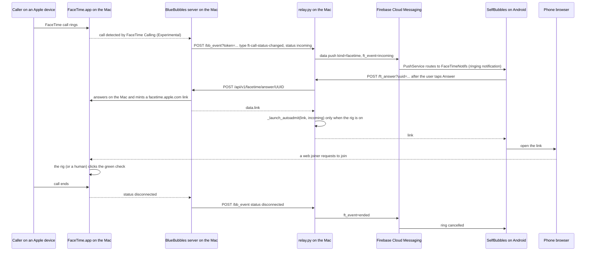
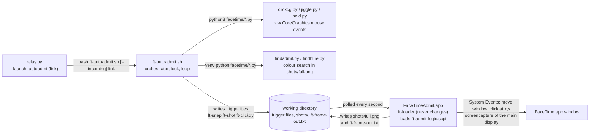

# FaceTime bridge

> **Read this first.** This is **a writeup of a display-specific rig; coordinates are hard-coded for the author's display; untested on other Macs and on macOS 27 beyond the author's machine.**
>
> More precisely, the bridge has two layers:
>
> - The *relay and app* layer (ring the phone, answer from the phone, mint a link) is ordinary HTTP against the BlueBubbles server. Its three BlueBubbles calls are unit-tested against a mocked BlueBubbles, and the `/ft_answer`, `/ft_decline` and `/ft_link` routes are tested against a scripted one: the success answers, a reply without a link, BlueBubbles' own HTTP errors, a BlueBubbles that cannot be reached, an answer that is not BlueBubbles' JSON, call ids that are not call ids, and the 501 without BlueBubbles. The `/bb_event` token check, the doctor strings and the rig's launch gating are pinned by tests as well. The webhook-to-push path, which is what rings the phone, and the app's ring and answer screens have **no automated tests** (the app's tests cover only the push routing table and the feature switches), and no test involves a real FaceTime call. The last end-to-end check with real calls that the author's notes record (ring, answer, connected call, both directions) was in July 2026 on macOS 26. On macOS 27 it is configured on the author's Mac, but an answered call carried through to a connected call has not been re-verified there.
> - The *Mac-side auto-admit rig* (the Mac clicks "admit" in FaceTime's own window so your phone gets into the call) is UI automation built in July 2026 on macOS 26 for one display. It has not been re-verified since the author's Mac, display and macOS version changed. To be exact: the rig has not been verified on macOS 27 on any machine, the author's included. It is **off by construction in every fresh checkout** and is **currently off in the author's own deployment** (`FT_AUTOADMIT=0`).
>
> With the rig off, the bridge rings your phone and hands you a link, but it does not get you *into* a call unless a person is at the Mac to let you in. See [What it does](#what-it-does).
>
> Nothing here works without a Mac that stays on and is signed into Messages and FaceTime, plus a BlueBubbles server with the Private API. Treat this document as an explanation of how the pieces fit and what you would have to redo, not as a feature you can switch on.

Contents

- [What it does](#what-it-does)
- [Requirements](#requirements)
- [How a call flows](#how-a-call-flows)
- [Relay side](#relay-side)
- [App side](#app-side)
- [Why the Mac has to click](#why-the-mac-has-to-click)
- [The auto-admit rig, piece by piece](#the-auto-admit-rig-piece-by-piece)
- [The hard-coded numbers](#the-hard-coded-numbers)
- [What a stranger would have to redo](#what-a-stranger-would-have-to-redo)
- [Known limits and open questions](#known-limits-and-open-questions)
- [File map](#file-map)

## What it does

FaceTime has no Android client, but a FaceTime *link* opens a web lobby that works in a phone browser. The bridge uses that:

- **Incoming call → ring the phone.** BlueBubbles sees the call ring on the Mac and posts a webhook to the relay. The relay pushes a high-priority notification that rings like a call (a ringtone channel with **Answer** and **Decline** buttons; it is not Android's `CallStyle` and not a full-screen incoming-call screen). Tapping **Answer** makes the relay ask BlueBubbles to answer the call *on the Mac* and mint a `facetime.apple.com` link for it; the app opens that link in the browser and you are in the call's web lobby, asking to be let in.
- **Outbound call from the phone.** The app's FaceTime screen asks the relay for a fresh link (BlueBubbles `POST /api/v1/facetime/session`). The app opens it in the browser and can text it to a contact over iMessage/SMS so they can tap to join. Minting a link does not, by itself, put the Mac into a call.
- **Getting let in.** A web joiner sits in the lobby until a participant who is already in the call lets them in. BlueBubbles tries to do that itself, but its method does not work on the author's Mac (see [Why the Mac has to click](#why-the-mac-has-to-click)). Doing it unattended is the job of the **auto-admit rig** described below, which makes the Mac that participant and clicks the green check for you.

Put plainly: with the rig off, which is the default and how the author runs today, the bridge does not get you into a call unless a person is at the Mac.

- *Incoming, rig off.* The phone rings, **Answer** makes the Mac pick up (the caller is now connected to the Mac), and you wait in the web lobby until someone at the Mac clicks the green check in FaceTime's window.
- *Outbound, rig off.* The link is minted and can be texted, but nothing on the Mac opens it or joins: opening the link in FaceTime.app and clicking **Join** is something only the rig does. You, and whoever you invited, wait until someone opens the link in FaceTime on the Mac, joins, and admits you. (Joining from another Apple device signed into the same account should serve equally well; that is untested here.)

Everything up to "getting let in" is independent of the rig and of your display. Everything from there on is the display-specific part.

## Requirements

Honest list, in addition to the relay's own requirements:

- A Mac that stays awake, signed into **both** Messages and FaceTime with the same Apple account. The Mac is a real participant in every incoming bridged call (BlueBubbles answers on it), and in outbound ones when the rig, or a person, joins from it.
- **BlueBubbles server** with the **Private API** helper working (SIP disabled on the Mac) and its **"FaceTime Calling (Experimental)"** feature turned on. The relay's FaceTime routes are thin proxies over BlueBubbles' `/api/v1/facetime/*` endpoints; there is no AppleScript fallback for FaceTime. With no `BB_PASSWORD` every `/ft_*` route answers `501 no configured engine can handle FaceTime`.
- BlueBubbles' webhook pointed at the relay's `/bb_event` (see [Webhook registration](#webhook-registration)).
- **Firebase Cloud Messaging** configured on both ends (`FCM_CREDS` on the relay, your own Firebase project in the app build). The incoming ring travels **only** over FCM: the relay also broadcasts a `facetime` event on its WebSocket, but the app's `WsManager` acts only on `message` and `update` frames, so without push there is no ring. Outbound calls do not need push.
- An Android browser that FaceTime's web client accepts. For outbound calls the app tries Chrome first and falls back to the default browser; the Answer screen hands the link to whatever browser is the default.
- For testing: another Apple device that can place a FaceTime call to the Mac's account (the incoming direction), and the phone's browser (outbound, and calibration of the rig).
- For the auto-admit rig only:
  - Pillow in the relay venv (it is in `requirements.txt`), an Accessibility- and Screen-Recording-granted helper app that you must build yourself, FaceTime.app left running on the Mac, and coordinates calibrated to your display.
  - The Mac logged in, with the screen unlocked and the display awake, whenever a call arrives. The rig clicks and screenshots the live desktop. Behind a lock screen or a sleeping display it cannot work, and it will not say so: expect nothing clearer than `none waiting` or `no FaceTime window; abort` in `ft-auto.log`. (That failure mode is inferred from the code, not observed.)
  - The FaceTime window rectangle on the **main** display, with nothing covering it.
  - A Mac nobody else is using: the rig moves the real pointer and brings FaceTime to the front on every round, so it interrupts whoever is at the keyboard.
  - A working bare `python3` on the relay's `PATH` for the three mouse helpers. Under launchd that is normally `/usr/bin/python3`, which works only with the Xcode Command Line Tools installed. The helpers' output is discarded, so a missing interpreter is silent.

## How a call flows

Outbound is the same from `_launch_autoadmit` onwards, except that the link comes from `POST /ft_link` → BlueBubbles `POST /api/v1/facetime/session` and nobody has answered anything, so the Mac is not in a call yet: the rig first has to open the link in FaceTime.app and click **Join** itself. With the rig off, that is a person's job.

## Relay side

All code is in [`relay.py`](../relay.py) (section `# ---------- facetime ----------`) and [`engines/bluebubbles.py`](../engines/bluebubbles.py).

A note before you read that code next to this document: the comments at the top of the facetime section and on `/ft_link` in `relay.py` used to say that BlueBubbles auto-admits the web joiner and then leaves the call; they now say what this document says. The comments in the app's `FaceTime.kt`, `FaceTimeScreen.kt` and `Imsg.kt` were corrected the same way: they say that the Mac admits the phone by itself only when the optional auto-admit rig is enabled; see [Why the Mac has to click](#why-the-mac-has-to-click).

### Routes

| Route | Auth | What it does | Failure |
|---|---|---|---|
| `POST /bb_event` | `?token=` or `X-Imsg-Token` | Webhook receiver for BlueBubbles. Only `type == "ft-call-status-changed"` is acted on; anything else is acknowledged with `{"ok": true}`. Outgoing calls (`is_outgoing`) and events without a `uuid` are ignored. `status == "incoming"` → FCM push `ft_event=incoming` plus a WebSocket broadcast; `status == "disconnected"` → push `ft_event=ended` plus a broadcast. The caller address is resolved to a contact name on the relay. | `401` without a valid token (when `IMSG_TOKEN` is set); otherwise always `200 {"ok": true}`, even for a body that is not JSON |
| `POST /ft_answer?uuid=` | token | `FaceTimeBridge.answer(uuid)` → BlueBubbles `POST /api/v1/facetime/answer/{uuid}` (90 s timeout). On success it starts `_launch_autoadmit(link, incoming=True)`, which does nothing unless the rig is on, and returns `{"link": "..."}`. Blocks 5–40 s in practice: BlueBubbles waits for the call to connect and then generates the link. | BlueBubbles' HTTP status passed through when it answers with an error; `502 BlueBubbles returned no link`; `502 BlueBubbles unreachable` when BlueBubbles cannot be reached at `BB_URL` or does not answer within the timeout, and `502 BlueBubbles returned an unexpected answer` when a 2xx body is not BlueBubbles' JSON (both used to surface as a bare 500); `501` when no engine handles FaceTime; `422` without `uuid`, or when `uuid` is not a call id (letters, digits, `.`, `_`, `-`, at most 128 characters; BlueBubbles reports calls by UUID) |
| `POST /ft_decline?uuid=` | token | `FaceTimeBridge.leave(uuid)` → BlueBubbles `POST /api/v1/facetime/leave/{uuid}` (30 s). Returns `{"ok": true}`. | Status passed through; `502 BlueBubbles unreachable` when BlueBubbles cannot be reached or times out; `501` without BlueBubbles; `422` without `uuid` or when it is not a call id |
| `POST /ft_link` | token | `FaceTimeBridge.new_link()` → BlueBubbles `POST /api/v1/facetime/session` (90 s). On success it starts `_launch_autoadmit(link)` (outbound mode; again a no-op unless the rig is on) and returns `{"link": "..."}`. | BlueBubbles' HTTP status passed through; `502 BlueBubbles returned no link`; `502 BlueBubbles unreachable` when BlueBubbles cannot be reached or times out; `502 BlueBubbles returned an unexpected answer` for a 2xx body that is not BlueBubbles' JSON; `501` without BlueBubbles |

The routes are **always mounted**; `features.facetime` in `/health` never gates a route. The app uses that flag only to annotate Settings > Features and to seed the switches of a never-configured build once. The app's own FaceTime switch decides whether the Call icon shows and whether a ring is posted (see [App side](#app-side)).

### What BlueBubbles provides

The relay relies on three BlueBubbles server endpoints and one webhook event, wrapped in `BlueBubblesFaceTime` (the `FaceTimeBridge` protocol from [`engines/base.py`](../engines/base.py)):

- `POST /api/v1/facetime/answer/{uuid}` — answers the ringing call on the Mac, waits for it to connect, mints a FaceTime link for that call and returns it as `data.link`.
- `POST /api/v1/facetime/leave/{uuid}` — declines or leaves.
- `POST /api/v1/facetime/session` — mints a fresh link for a new call.
- Webhook event `ft-call-status-changed` with `data.status` (`incoming` / `disconnected`), `data.uuid`, `data.address`, `data.is_video`, `data.is_outgoing`.

BlueBubbles also has its *own* logic for letting the web joiner in and then leaving the call. On the author's Mac it does not work, which is why the rig exists; see [Why the Mac has to click](#why-the-mac-has-to-click).

`BlueBubblesEngine` is the only engine with `Capability.FACETIME`; `first_with(chain, Capability.FACETIME)` finds it. The AppleScript and Beeper engines report `facetime = None`.

### Webhook registration

Register the webhook in BlueBubbles as `http://127.0.0.1:<IMSG_PORT>/bb_event?token=<IMSG_TOKEN>` for the single event `ft-call-status-changed`. In the BlueBubbles server app (version 1.9.9 on the author's Mac) that is **API & Webhooks** → **Manage** → **Add Webhook**, with only the event labelled **FaceTime Call Status Changed (Experimental)** selected.

- Use `127.0.0.1`, **not** `localhost`: BlueBubbles (Node) resolves `localhost` to `::1` and the relay listens on IPv4 only. `127.0.0.1` reaches the relay whether it is bound to loopback (`IMSG_BIND=127.0.0.1`, the example files' setting) or to every interface.
- The token has to ride in the query string because BlueBubbles cannot set request headers. The relay still accepts `?token=` wherever its auth middleware and WebSocket gate look (BlueBubbles needs it here; the map page and older clients use it too). What changed is the logging: the access log and every `print()` mask `token=` values to `***` (`mask_token`), so the webhook URL never lands in `relay.log` in clear.

### Feature flag

`engines/features.py` derives `facetime = BB_PASSWORD is set` (and `voice = facetime`). It is **not** keyed on `FT_AUTOADMIT`, so a deployment like the author's, with the rig off, still advertises and serves the bridge routes. `FEATURE_FACETIME=1/0` overrides. Both [`.env.example`](../.env.example) and [`launchd/org.selfbubbles.relay.plist.example`](../launchd/org.selfbubbles.relay.plist.example) ship `FEATURE_FACETIME=0`, so a fresh install advertises no FaceTime. Deleting the line lets the relay derive it, but that changes only what `/health` advertises. It does not flip the switch in the app: an app built from `secrets.properties.example` (which ships `FEATURES=`) starts with FaceTime off whatever the relay reports, and a build that could be seeded has normally used its one seed already. Turn the switch on in the app (see [App side](#app-side)).

### Environment keys

| Key | Default | Meaning |
|---|---|---|
| `BB_URL`, `BB_PASSWORD` | `http://localhost:1234`, unset | The BlueBubbles server. No password → no FaceTime (and `features.facetime=false`). A password that is still a shipped placeholder (`CHANGE-ME`, `change-me…`) counts as no password. |
| `FCM_CREDS` | unset | Firebase service-account JSON; without it `send_facetime_push` returns immediately and the phone never rings. |
| `FEATURE_FACETIME` | derived | Force what `/health` advertises; UI only. |
| `FT_AUTOADMIT` | `1` | `0` turns the Mac-side rig off even when the helper app exists. Any other value (or unset) lets `autoadmit_state()` fall through to the helper-app check. **`1` cannot turn the rig on without the app.** The plist example sets it to `0` as a live key; `.env.example` ships it commented out (`#FT_AUTOADMIT=0`). |
| `FT_ADMIT_APP` | `FaceTimeAdmit.app` beside `relay.py` | Path of the Accessibility-granted loader app. The relay only tests that it *exists*, on every link; it never launches or rebuilds it. |
| `RELAY_DATA_DIR` | the checkout directory | Where `ft-autoadmit.sh` writes `ft-auto.log`, the lock directory and the trigger files, and where it expects to find `shots/` and `ft-frame-out.txt`. Passed down to `ft-autoadmit.sh` in its environment. The AppleScript side does not read it; see the caveat under [The AppleScript side](#the-applescript-side) before changing it. |
| `LEAVE_DELAY` | `4` | Seconds the rig waits after the last admission before clicking Leave; `0` keeps the Mac in the call. Has no effect unless the rig runs. |
| `RELAY_PYTHON` | `venv/bin/python` in the checkout | Interpreter for the two Pillow finders. Set it if your venv is elsewhere; otherwise the finders fail silently and every round reports `none waiting`. |

`LEAVE_DELAY` and `RELAY_PYTHON` are not read by `relay.py` and are not in `.env.example`. `ft-autoadmit.sh` reads them, and it inherits the relay's whole environment, so set them where the relay gets its environment (the plist, or `.env`) and restart the relay. After an edit to `.env`, `launchctl kickstart -k gui/$UID/org.selfbubbles.relay` is enough. After an edit to the plist it is not: a kickstart restarts the process but launchd does not re-read the plist's `EnvironmentVariables`, so `bootout` and `bootstrap` the job, as in step 8 of [What a stranger would have to redo](#what-a-stranger-would-have-to-redo).

### Doctor rows

`venv/bin/python relay.py --check` prints status words only, and the relay prints the same table every time it starts. Run from a terminal, `--check` describes the terminal's environment plus `.env`; for a LaunchAgent configured through the plist's `EnvironmentVariables`, the table in `relay.log` is the one that describes the running relay. The rows that concern this bridge, with the exact strings:

| Component | Status | Hint |
|---|---|---|
| `BlueBubbles` | `password set, server reachable` — what the bridge needs | (none) |
| | `password set, server unreachable` | `check BB_URL and that the BlueBubbles server is running` |
| | `no password (AppleScript only), server reachable` or `unreachable` | `set BB_PASSWORD for tapbacks, replies, new chats, group icons, names and FaceTime` |
| | `placeholder — treated as unset, server reachable` or `unreachable` — `BB_PASSWORD` still holds an example's value, so there is no bridge | `BB_PASSWORD still holds the example's placeholder (sends then go through AppleScript only): set the BlueBubbles server password, or remove the key` |
| `FCM push` | `credentials file found` — what the ring needs | (none) |
| | `disabled` | `set FCM_CREDS to a Firebase service-account JSON for push notifications` |
| | `credentials file MISSING` | `FCM_CREDS does not name a readable file` |
| | either of the `credentials file` states followed by `, firebase-admin NOT installed` | `pip install firebase-admin` |
| `features advertised` | e.g. `facetime, voice` or `(none)` | `FEATURE_FACETIME/MAP/TRANSLATE/VOICE override what /health reports` |
| `data dir` | `<path> (writable)` / `(NOT writable)` | `RELAY_DATA_DIR must be a directory the relay can write` |
| `FaceTime auto-admit` | `off (helper app missing), script found, helper app missing` — a fresh checkout configured through `.env`, where `FT_AUTOADMIT` is commented out | `off by construction: the rig needs the Accessibility-granted helper app named by FT_ADMIT_APP (owner-specific, never rebuilt)` |
| | `off (FT_AUTOADMIT=0), script found, helper app missing` — a fresh install from the plist example, which sets `FT_AUTOADMIT=0` | (none) |
| | `off (FT_AUTOADMIT=0), script found, helper app found` — the author today | (none) |
| | `on, script found, helper app found` | `the auto-admit rig is display-specific; FT_AUTOADMIT=0 turns it off` |
| | `on, script MISSING, helper app found` | `ft-autoadmit.sh is missing beside relay.py` |

At runtime, minting a link while the helper app is missing logs `[facetime] auto-admit skipped: helper app missing (FT_ADMIT_APP)` once per link and does nothing else. With `FT_AUTOADMIT=0` (the plist example, and the author's deployment) it logs nothing at all.

### Tests

`tests/test_engines.py::test_bb_facetime_bridge` exercises the three BlueBubbles calls against a mock transport with synthetic links. `tests/test_facetime_routes.py` drives `/ft_answer`, `/ft_decline` and `/ft_link` through the ASGI test client against a scripted BlueBubbles: the success answers and the `_launch_autoadmit` call each makes (replaced by a recorder, so the rig never starts), a reply without a link (502), BlueBubbles' own HTTP errors passed through, four kinds of transport failure (502 `BlueBubbles unreachable`), a 2xx answer that is not BlueBubbles' JSON (502 `BlueBubbles returned an unexpected answer`), the 501 without BlueBubbles, and the 401 and 422. The same file checks the call id: the routes answer 422 to a `uuid` such as `../../message/text` before BlueBubbles is asked, and the engine, called directly, never requests a path outside `/api/v1/facetime/<verb>/<one segment>` (the `uuid` is put into the path of a request made with the server password, so this matters; see [SECURITY.md](../SECURITY.md), control 12). `tests/test_doctor.py` pins the doctor strings, the default paths, that `ft-autoadmit.sh` finds its helpers in `facetime/` and not in the data dir, that `_launch_autoadmit` runs `/bin/bash ft-autoadmit.sh [--incoming] <link>` with `RELAY_DATA_DIR` in the environment and `start_new_session=True`, and that it is a no-op without the app or with `FT_AUTOADMIT=0`. `tests/test_auth_logging.py` checks that `/bb_event` accepts the query token and the header and rejects a missing or wrong token with 401 (using an event of another type, which the route ignores), and that the launch log line is masked. `tests/test_example_configs.py` pins what the two example files ship, including `FT_AUTOADMIT`.

Not covered by any test: a `ft-call-status-changed` body reaching `send_facetime_push` (the ring itself), the `is_outgoing` filter, and everything on the app's side. None of the tests touch a real FaceTime or a real BlueBubbles server.

## App side

Files under the app's source package in the Android repository (`Avtraang/selfbubbles`).

- **`PushService.kt`** — `onMessageReceived` runs every data push through `PushGate.route(kind, ft_event, Features.faceTime)`:

  | `kind` | FaceTime switch | `ft_event` | Route |
  |---|---|---|---|
  | anything but `facetime` | — | — | `MESSAGE` (normal notification) |
  | `facetime` | on | any | `FACETIME` → `FaceTimeNotifs.handle` |
  | `facetime` | off | `ended` | `FACETIME_CANCEL` → take down a ring posted before the switch was flipped |
  | `facetime` | off | anything else | `DROPPED` (no notification, no log line) |

  The push payload is data-only, all strings: `kind=facetime`, `ft_event` (`incoming` / `ended`), `uuid`, `caller`, `caller_name`, `is_video` (`"1"`/`"0"`), sent with Android priority `high`.

- **`FaceTime.kt`** — `FaceTimeNotifs` posts the ring: its own channel named "FaceTime" at `IMPORTANCE_HIGH` with the default **ringtone** as its sound, `CATEGORY_CALL`, `PRIORITY_MAX`, ongoing, not auto-cancel, title = caller name (or address, or "Unknown"), text "Incoming FaceTime Video/Audio", **Answer** and **Decline** actions, and `setTimeoutAfter(60_000)`. Notification id = `uuid.hashCode()`. An `ended` event cancels it.

  This is a heads-up notification, not an incoming-call screen. It is a plain `NotificationCompat.Builder` notification: there is no `CallStyle` and no full-screen intent, the ringtone is the channel's sound and is not looped, it needs the notification permission (a refused `notify` is swallowed without a log line), and it is subject to the phone's Do Not Disturb rules. The 60-second timeout removes the notification; it does not mean a minute of ringing.

  `FaceTimeAnswerActivity` (manifest: not exported, excluded from recents, `showWhenLocked` + `turnScreenOn`, which apply to this screen after the tap and not to the ring) is the Answer target. If the FaceTime switch is off it cancels the notification and finishes before doing anything else. Otherwise it shows a dark progress screen with the statuses "Answering on the Mac…" → "Getting your join link…" → "Joining…", calls `Api.ftAnswer(uuid)` on the long-timeout HTTP client, and on success fires `ACTION_VIEW` on the link and finishes. On failure it shows: *"Couldn't answer — the call may have ended, or link generation failed on the Mac. Try again from the Mac."*

- **`NotifActions`** (in `PushService.kt`) handles the **Decline** action (`FT_DECLINE` broadcast): cancels the notification, then `Api.ftDecline(uuid)`.

- **`FaceTimeScreen.kt`** — the outbound screen, reached from the Call icon in the thread-list top bar (shown only while the switch is on; `ChatVM.openFaceTime()` also refuses when it is off). **New FaceTime Call** → `Api.ftNewLink()` → opens the link, preferring Chrome, falling back to the default browser; the last link stays on screen with Copy / Share / Join. **Call a contact** → mints a link, texts `FaceTime: <link>` into an existing thread (`matchChat` + `send`) or a new one (`createChat`, which needs BlueBubbles), then opens the link locally. Failure toast when no link could be minted (nothing is opened then): *"Couldn't create the call — link generation failed on the Mac. Try again."* When the link was minted but could not be texted, the toast is *"Couldn't text the link — opening yours"*, or, when it is not certain that the send failed, *"The link may have been sent — check the chat before sending it again. Opening yours"*; the link is opened locally in both cases.

- **`Imsg.kt`** — `Api.ftAnswer` and `Api.ftDecline` `POST` with the `uuid` as a query parameter, `Api.ftNewLink` `POST`s with no parameters; all three send an empty body. `ftAnswer` and `ftNewLink` use the long-timeout client because the Mac legitimately takes 5–40 s.

- **`Features.kt` / `SettingsScreen.kt`** — the `FaceTime` switch under Settings > Features ("Rings for incoming FaceTime calls and answers them through the Mac."). **The switch is local to the app and is the source of truth.** While it is off the ring push is dropped, the Call icon is hidden and the Answer screen finishes at once. Turning it off calls `FaceTimeNotifs.cancelAll`.

  What the relay reports in `/health` never flips the switch. The app reads that report only on a successful **Test connection** or **Save** in the Relay settings, and uses it for two things. It annotates the row with "The relay reports this as unavailable." when the relay said `facetime: false`; the switch stays usable. And it can seed starting values, in one case only. Starting values are: the `FEATURES` build key if present (`secrets.properties.example` ships `FEATURES=`, present and empty, so every switch starts off); else all four features on when `RELAY_REMOTE_BASE` was baked into the build, off otherwise. Only a build with neither key is seedable: it takes its first values from the first successful Test connection or Save, once, and only if no switch was set before. A relay still running with `FEATURE_FACETIME=0` at that moment seeds FaceTime as off, and no later report changes it.

Nothing in the app knows about the auto-admit rig. From the phone's point of view the Mac either lets you in or it does not.

The app's unit tests that touch this bridge are `PushGateTest` (the routing table above), `FeaturesTest` (the switch and seeding rules) and `RelayProbeTest` (parsing the `/health` features map), plus one case in `SendRecoveryTest` for the choice between the two link-texting toasts. Nothing tests `FaceTimeNotifs`, `FaceTimeAnswerActivity`, `FaceTimeScreen` or the `Api.ft*` calls.

## Why the Mac has to click

A FaceTime link joiner on the web is held in a lobby until an existing participant approves them. BlueBubbles tries to do that approval itself. In BlueBubbles server 1.9.9, the version on the author's Mac, the code that runs after a link is generated polls the macOS **notification database** once a second for a FaceTime notification whose text contains "join", admits that joiner through its Private API helper, waits 15 seconds and leaves the call. It looks for that database at `$(getconf DARWIN_USER_DIR)/com.apple.notificationcenter/db2/db`.

On the author's Mac that path does not exist (checked on macOS 27.0). The database is at `~/Library/Group Containers/group.com.apple.usernoted/db2/db`, with write-ahead-log files beside it. According to the author's July 2026 build notes the same was true on macOS 26, where the database was also held open by `usernoted` and could not be read reliably from outside. So BlueBubbles answers and mints the link fine, but never sees the join request, and the web joiner stays in the lobby. If BlueBubbles' own admit works on your combination of macOS and BlueBubbles versions, you do not need the rig at all; the author has not seen it work.

The first attempt at a fix ([`ft-admit.applescript`](../ft-admit.applescript)) watched Notification Center's accessibility tree for the join notification and pressed its action button. It is kept in the repository as a record of that approach and of the Notification Center element structure observed on macOS 26.3; **nothing loads it**. Its own comments show the uncertainty that stopped it: the banner's primary button is logged as "(approve?)" and the script probes the options menu to find out where approve and decline actually live. The window-based rig below superseded it.

What shipped instead: the Mac is already *in* the call (BlueBubbles answered on it, or the rig opened the outbound link and clicked Join), so FaceTime's own call window shows an "N Person Waiting" pill, and clicking it opens a popover with a red ✗ and a green ✓ per waiting joiner. The rig finds that green check by colour and clicks it. FaceTime's window is SwiftUI with almost no accessibility labels, which is why this is colour detection and coordinates rather than named buttons.

## The auto-admit rig, piece by piece

Three layers: a Bash orchestrator; five small Python helpers, three that post raw mouse events and two that search a screenshot by colour; and an AppleScript side that holds the privacy grants and does the things only a granted process can do (screen capture, `System Events` clicks, moving FaceTime's window).

The "working directory" is `RELAY_DATA_DIR` for the orchestrator and a hard-coded path for the AppleScript side. The rig works only when the two are the same directory; see the path caveat under [The AppleScript side](#the-applescript-side).

### `ft-autoadmit.sh`

[`ft-autoadmit.sh`](../ft-autoadmit.sh) is what the relay starts, detached (`start_new_session=True`), with stdout/stderr appended to `ft-auto.log`. Two modes:

- `ft-autoadmit.sh "<link>"` — **outbound**. `open -a FaceTime` (so FaceTime is running and in front), then `open -a FaceTime "<link>"` in up to four attempts (plain `open` may hand the link to the browser instead), wait 4 s, snap the window to the fixed rectangle, take a screenshot and look for the blue **Join New Call** button with `findblue.py` — that button appears in an "End Current Call?" dialog when the Mac was *already* in a call; if found it is clicked and the script goes straight into the admit loop. Otherwise it jiggles the mouse over the window (FaceTime hides its controls when the mouse is still) and `System Events`-clicks **Join** at a fixed offset from the window's bottom-right corner.
- `ft-autoadmit.sh --incoming "<link>"` — **incoming**. BlueBubbles has already answered, so the Mac is in the call: `open -a FaceTime` (which raises it), then only snap the window and go to the admit loop.

The **admit loop**, each round: snap the window again (FaceTime re-lays itself out as participants change), jiggle to wake the controls, raw-click the "N Person Waiting" pill (a CoreGraphics click is enough to open it), start `hold.py` parking the cursor in the popover's button zone so it does not auto-hide, screenshot, run `findadmit.py` on `shots/full.png` restricted to the window rectangle. If it returns coordinates: park the cursor on them, `System Events`-click them (**only a System Events click registers on the ✓; a raw CoreGraphics click merely hovers it**), and count one admission. The script does not check that the click admitted anyone. The loop runs at most 40 rounds; it stops early after 12 rounds if nobody ever asked to join, or after 3 consecutive empty rounds once at least one person was admitted (so a two-person call admits both). A round takes roughly ten seconds, so giving up after 12 rounds means about two minutes.

Afterwards, if anyone was admitted and `LEAVE_DELAY` (default 4 s) is not `0`, the Mac clicks the red **Leave** button at a fixed offset from the bottom-right corner. `LEAVE_DELAY=0` keeps the Mac in the call.

Other behaviour worth knowing:

- **Single instance.** `mkdir "$BASE/ft-auto.lock"` is the lock (atomic). A second run exits `0` with "another auto-admit already running; skip" unless the lock is older than 3 minutes, in which case it is taken over. The app can double-fire `/ft_link`, and two runs racing on the shared trigger files corrupt each other.
- **Exit codes.** `0` clicked what it took for a check at least once (or skipped as a duplicate); the script never verifies that the joiner actually got in. `1` no FaceTime window after two snaps ("no FaceTime window; abort"). `2` nobody asked to join before the loop gave up.
- **Never close all FaceTime windows first.** FaceTime quits when its last window closes, `open` then fails with `-600`, and BlueBubbles' injected FaceTime instance dies with it. (`ft-admit-logic` still has a `ft-closewins` trigger from the discovery days; the shipped script does not use it.)
- **Paths and interpreters.** `HERE` is the checkout (script and `facetime/` helpers); `BASE` is `RELAY_DATA_DIR` or `HERE`; `PY` is `RELAY_PYTHON` or `venv/bin/python` in the checkout and is used only for the two Pillow scripts. The three mouse helpers run under whatever a bare `python3` resolves to on the `PATH` the relay was started with. Under launchd that is normally `/usr/bin/python3`, which works only with the Xcode Command Line Tools installed.
- **Silent helpers.** Every helper call discards its output (`>/dev/null 2>&1`, or `2>/dev/null` for the finders). A missing interpreter, a missing Pillow or a refused mouse event all look the same in `ft-auto.log`: `none waiting`.

### The Python helpers (`facetime/`)

`clickcg.py`, `jiggle.py` and `hold.py` post mouse events through CoreGraphics via `ctypes` and use only the standard library. `findadmit.py` and `findblue.py` post nothing: they read a PNG with Pillow.

The comment at the top of `clickcg.py` says it works from a shell without an Accessibility grant, and the author's build notes say the same of the two other mouse helpers on macOS 26. Whether macOS lets a given process post synthetic mouse events depends on what launched it, and that has not been checked for a relay started by launchd, on macOS 27, or on any other Mac. Test it directly: `python3 facetime/jiggle.py 600 400 2` should visibly move the pointer for two seconds. If it does not, the process that launched it (your terminal for manual runs, the relay's Python under launchd) is being refused, most likely for want of an Accessibility grant, and the orchestrator will not tell you.

| File | Role | Arguments |
|---|---|---|
| [`clickcg.py`](../facetime/clickcg.py) | Raw HID-level click: move, then `count` × (down, hold, up). Opens the "N Person Waiting" pill; **does not** register on the ✓. | `x y [count] [hold_ms]` |
| [`jiggle.py`](../facetime/jiggle.py) | Posts mouse-moved events around a centre for N seconds so FaceTime shows its controls. | `cx cy [seconds]` |
| [`hold.py`](../facetime/hold.py) | Parks the cursor at x,y with 1-pixel in-place moves for N seconds so hover UI (the popover) stays open. Run in the background and killed by the orchestrator. | `x y [seconds]` |
| [`findadmit.py`](../facetime/findadmit.py) | Finds the green ✓ in a screenshot: pixels within tolerance 48 of `#34C759` (green) and `#FF3B30` (red), 8-connected clusters of ≥25 px, pick a green cluster that has a red cluster 5–130 px to its left and within 40 px vertically; **fall back to the largest green cluster** when there is no such pair. Searches only inside the window rectangle minus a `topskip` (title bar; the orchestrator passes 80 pt) and the bottom 40 pt (toolbar). Lists the clusters it found on stderr and prints `x,y` in screen points or `NONE`. | `image scale [wx wy ww wh] [topskip]` — `scale` is screen points per image pixel (`0.5` on a 2× display) |
| [`findblue.py`](../facetime/findblue.py) | Finds the blue "Join New Call" button: largest blob of ≥1500 px within tolerance 40 of `(59,113,246)` (`#3B71F6`) inside the window rectangle. Prints `x,y` or `NONE`. | `image scale [wx wy ww wh]` |

Both finders convert image pixels to screen points by multiplying with `scale` and nothing else, so they assume the screenshot's top-left pixel is screen point 0,0. That holds for a screenshot of the main display only.

### The AppleScript side

Two source files and one compiled app. The split exists because of how macOS TCC works: Accessibility and Screen Recording grants are tied to the code signature of the *app bundle*. Editing an applet rebuilds it with a new ad-hoc signature and the grants silently die. So the bundle is a **loader that never changes**, and the logic lives in a separate compiled script it reloads every second.

- [`ft-loader.applescript`](../ft-loader.applescript) — the loader. `repeat`: `load script` `<home>/imsg-relay/ft-admit-logic.scpt`, call its `admitPass()`, `delay 1`. Errors are appended to `<home>/imsg-relay/facetime-admit.log` as `loader err:` lines. This is the source of `FaceTimeAdmit.app/Contents/Resources/Scripts/main.scpt`.
- [`ft-admit-logic.applescript`](../ft-admit-logic.applescript) — the logic, compiled to `ft-admit-logic.scpt` (git-ignored) with `osacompile`. Editing *this* file needs no re-grant. `admitPass()` polls a set of **trigger files** in `<home>/imsg-relay/` and consumes (deletes) each one it acts on:

  | Trigger file | Content | Action |
  |---|---|---|
  | `ft-snap` | `x,y,w,h` | Bring FaceTime to the front, move and resize window 1 to that rectangle (the position is applied twice, around a short delay), write the resulting frame to `ft-frame-out.txt` and log `snapped -> ...`. The orchestrator's `haswin` test reads that file. |
  | `ft-shot` | (empty) | `screencapture -x` of the **main display** to `shots/full.png`, copied to `shots/latest.png` and downsized to 1600 px; logs `screenshot -> ...`. The finders read `full.png`. |
  | `ft-clickxy` | `x,y` | `tell application "System Events" to click at {x, y}` — the click that actually admits. |
  | `ft-click` | button text | Click the FaceTime `AXButton` whose name or description contains the text. Discovery aid; unused by the shipped script. |
  | `ft-region` | `x,y,w,h` | Screenshot a region to `shots/region.png`, upscaled. Discovery aid. |
  | `ft-frame` | (empty) | Write FaceTime window 1's frame to `ft-frame-out.txt` without moving it. |
  | `ft-dump` / `ft-nc` | (empty) | Dump the FaceTime / NotificationCenter accessibility tree with positions to `facetime-admit.log`. Discovery aid — this is how the coordinates were found. |
  | `ft-closewins` | (empty) | Close every FaceTime window. Do not use while bridging (see above). |

  Everything is logged to `facetime-admit.log` (git-ignored).

  **Errors are not reported evenly.** `ft-snap`, `ft-clickxy`, `ft-click` and `ft-region` are dispatched inside a `try` that has no `on error`, so a failure deletes the trigger and stops there. `ft-clickxy` and `ft-region` log their own errors first; `ft-snap` logs nothing, so a snap that fails for want of a privacy grant looks exactly like "no FaceTime window". `ft-dump`, `ft-nc`, `ft-frame` and `ft-closewins` run outside that `try`, and their errors surface as `loader err:` lines. `ft-shot` logs `shoot err:` when the command fails, but a screen capture made without the Screen Recording grant does not fail; it just leaves other apps' windows out of the picture.

  **Path caveat.** Both AppleScript sources hard-code `<home>/imsg-relay/` — the author's checkout directory name — for the trigger files, `shots/`, `ft-frame-out.txt` and the log, while `ft-autoadmit.sh` uses `RELAY_DATA_DIR`. They agree only when `RELAY_DATA_DIR` is unset and the checkout is literally `~/imsg-relay`. A different checkout name or data directory means editing both `.applescript` files and recompiling the logic script — and, for the loader, rebuilding the app and re-granting.

- **`FaceTimeAdmit.app`** — the compiled loader applet, **git-ignored and never rebuilt**. It carries the author's Accessibility and Screen Recording grants (and the Automation grant to control System Events), which is exactly why it is not in the repository and why the relay only checks that the file exists. Its bundle identifier is the author's own reverse-DNS id; yours will be whatever you compile. It is an ordinary applet: it shows in the Dock while it runs, and if it is quit the rig stops. Nothing in the repository starts or supervises it: there is no LaunchAgent for it in this checkout and the relay never launches it. How it was kept running on the author's Mac is not recorded in the repository. If it is not running, the trigger files are simply never consumed and the orchestrator exits `1` ("no FaceTime window; abort") because `ft-frame-out.txt` never appears.

## The hard-coded numbers

Everything the rig clicks is derived from one fixed window rectangle, in screen points, chosen to be fully on-screen on the author's **3360 × 945-point** display at the time:

| Constant | Value | Meaning |
|---|---|---|
| `FX, FY, FW, FH` | `1800, 120, 984, 615` | Where the FaceTime window is snapped every round. |
| `JOINX, JOINY` | `RIGHT-66, BOTTOM-42` | The pre-join **Join** button (outbound only). |
| `PILLX, PILLY` | `FX+189, FY+26` | The "N Person Waiting" pill in the window's title area. |
| `ZONEX, ZONEY` | `PILLX+30, PILLY+120` | Where `hold.py` parks the cursor so the popover stays open. |
| Leave button | `RIGHT-42, BOTTOM-47` | The red Leave (×), bottom-right. |
| `findadmit` top skip | `80` pt | Title bar and toolbar excluded from the colour search. |
| screenshot scale | `0.5` | Points per pixel, passed to both finders as a literal in `ft-autoadmit.sh`; assumes a 2× (Retina) display. A 1× display needs `1`. |
| `LEAVE_DELAY` | `4` s (env) | Delay before the Mac leaves after the last admission; `0` = stay. |
| Colours | `#34C759`, `#FF3B30`, `#3B71F6` | System green / red / the Join New Call blue. Appearance (light/dark, accent colour, Increase Contrast) can change the rendered values. |

Apart from `LEAVE_DELAY`, none of these are configurable from the relay; they are literals in `ft-autoadmit.sh`. Move the window somewhere else, change display scaling, plug in a different monitor, or get a FaceTime update that moves the pill, and the clicks land on nothing. That is what "display-specific" means here. The rectangle also has to be on the main display, because that is the only display the screenshot covers.

## What a stranger would have to redo

Nobody has timed this on a second machine. If step 1 already works for you, budget an evening or two for steps 3 to 8, with a Mac you are willing to let click on itself. Step 1 on its own (BlueBubbles with the Private API, your own Firebase project, the app build) is a separate job: the [README](../README.md) covers the relay side, and the app repository's [docs/setup.md](https://github.com/Avtraang/selfbubbles/blob/main/docs/setup.md) covers the app build (step 3), BlueBubbles (5.1) and Firebase (5.3). On macOS 27 the rig may not be achievable at all: nobody has confirmed that FaceTime's window there still has the pill, the popover and these colours.

1. **Get the bridge without the rig working first.**
   - *Relay.* BlueBubbles with the Private API and "FaceTime Calling (Experimental)" on; `BB_PASSWORD` in the relay's environment; the webhook registered as described under [Webhook registration](#webhook-registration); FCM configured. In the doctor table the `BlueBubbles` row should read `password set, server reachable` and the `FCM push` row `credentials file found`.
   - *App.* Turn on **Settings > Features > FaceTime** (or build with `FEATURES=facetime` in `secrets.properties`). The relay's `FEATURE_FACETIME` does not do this for you: the switch is local to the app, and a build made from `secrets.properties.example` starts with FaceTime off whatever the relay reports. While the switch is off the app drops the ring push silently and hides the Call icon. On the relay, deleting the `FEATURE_FACETIME=0` line (or setting it to `1`) only makes `/health` stop reporting FaceTime as unavailable, which removes the note "The relay reports this as unavailable." after the next Test connection.
   - *Test incoming.* Place a FaceTime call to the Mac's account from another Apple device. The phone should ring, and **Answer** should open a web lobby. Admit yourself by clicking the green check in FaceTime on the Mac.
   - *Test outbound.* **New FaceTime Call** on the phone, then open the same link in FaceTime on the Mac (`open -a FaceTime "<link>"`), click **Join**, and admit the phone by hand.

   If this does not work, the rig will not help. If the phone does not ring, check in this order:

   1. `relay.log` shows `[facetime] incoming call <uuid> from <name>` when the Mac rings. If it does not, BlueBubbles is not delivering the webhook: FaceTime Calling is off, the URL uses `localhost` or the wrong port (`IMSG_PORT`, default 8700), or the token is wrong (the access log then shows `POST /bb_event?token=***` answered with 401).
   2. The relay's start-up output includes `[fcm] initialized — push enabled`, and `[fcm] registered device token (N total)` appeared when the app first registered. The relay skips the ring without logging anything when FCM is not initialised or no device token is registered.
   3. In the app, Settings > Push notifications reads "Push notifications: Firebase (this build includes google-services.json)." and Settings > Features > FaceTime is on.
   4. The app has the notification permission, its "FaceTime" notification channel is not silenced, and Do Not Disturb is not holding the ring back. A refused notification is not logged.

2. **Decide whether you want the rig at all.** Without it you get the ring and the link, and every admission is a click by a person at the Mac. If that is enough for you, stop here. (`LEAVE_DELAY` is read only by `ft-autoadmit.sh`, so it has no effect unless the rig runs.)

3. **Keep the rig disarmed while you build it.** Set `FT_AUTOADMIT=0` in the relay's environment now and leave it there until step 8. With a `.env` install, uncomment the `#FT_AUTOADMIT=0` line and restart the relay; an install from the plist example already has the key, set to `0`. The reason: the default is `1`, and the relay looks for the helper app every time a link is minted, with no restart. From the moment `FaceTimeAdmit.app` exists beside `relay.py` (step 5), every `/ft_answer` and `/ft_link` would start `ft-autoadmit.sh` with the author's coordinates. It opens FaceTime (and, for an outbound link, opens the link in it), and once the loader is running it also moves the FaceTime window, takes over your pointer and clicks at fixed screen points for up to 12 rounds. If it takes something green for the check, it clicks that and then the spot where the author's Leave button was. All the while it holds the lock, so your own manual runs exit with `another auto-admit already running; skip`.

4. **Fix the paths.** The least-effort route is to clone the repository into `~/imsg-relay` and leave `RELAY_DATA_DIR` unset: then nothing needs editing. (That does not happen by accident: the repository's default clone name is different, and the plist example uses `/Users/YOU/selfbubbles-relay`.) Otherwise change all ten lines of code that contain `imsg-relay/` (2 in `ft-loader.applescript`, 8 in `ft-admit-logic.applescript`) to your data directory. Each path is built as *home folder* + `imsg-relay/...`, so a directory outside your home folder needs the expression rewritten, not just the name. `grep -c 'imsg-relay/' ft-loader.applescript ft-admit-logic.applescript` should print `0` for both files when you are done. Whatever you choose must be the directory `ft-autoadmit.sh` uses: `RELAY_DATA_DIR`, or the checkout when that is unset.

5. **Compile.** `osacompile -o ft-admit-logic.scpt ft-admit-logic.applescript` for the logic (the output must end up where the loader's `logicPath` points), and `osacompile -o FaceTimeAdmit.app ft-loader.applescript` for the loader applet. The repository does not record the exact commands used in July 2026; these are the standard ones. The author's applet carries its own bundle identifier in `Info.plist`, and how that was set is not recorded either. If you change yours, do it before step 6 and re-sign the bundle afterwards, for example with `codesign --force --sign - FaceTimeAdmit.app`: `Info.plist` is covered by the bundle's signature, and the privacy grants attach to that signature. This is untested. The result is an ordinary applet: it shows in the Dock while it runs, and quitting it stops the rig. Keep the loader stable from here on: every rebuild starts step 6 again.

6. **Grant, and prove each grant.** Launch the applet (`open FaceTimeAdmit.app`); `facetime-admit.log` should gain the line `=== FaceTime admit loader started ===`. Nothing asks for permission at launch, because the loader touches System Events and the screen only when a trigger file arrives. Add the app under System Settings > Privacy & Security > **Accessibility** and > **Screen Recording** (labelled "Screen & System Audio Recording" on recent macOS versions). Then, with a FaceTime window open and from the data directory, force and check each grant:
   - `touch ft-dump`. Approve the **Automation** prompt for System Events when it appears. The log must show `---- DUMP FaceTime ----`, a `FaceTime windows=` line with a count of at least 1, and element lines. A `loader err:` line here most likely means Automation or Accessibility is missing.
   - `printf '100,100,984,615' > ft-snap`. The log must show `snapped -> ...` and `ft-frame-out.txt` must appear. This trigger swallows its errors, so silence means a missing grant as easily as a missing window.
   - `touch ft-shot`. Open `shots/latest.png` and check that FaceTime's window is in the picture. A capture that shows the desktop without it means Screen Recording is missing; `screencapture` does not report that as an error.

   The absence of `loader err` lines proves nothing on its own.

7. **Calibrate.** Work in the data directory, with `FT_AUTOADMIT` still `0`. The Mac and the phone are enough. The commands below assume the data directory is the checkout.
   1. *Rectangle.* Choose one that lies entirely on your **main** display: the screenshot covers the main display only, and the finders assume image pixel 0,0 is screen point 0,0. The author's `1800,120` origin is off-screen on most single displays. Keep `984x615` at first, because every other constant is an offset from the window's corners: `printf '100,100,984,615' > ft-snap`, check that `ft-frame-out.txt` echoes it, and put your values into `FX FY FW FH` in `ft-autoadmit.sh`.
   2. *Pre-join screen (Join).* Mint a link with **New FaceTime Call** in the app (the FaceTime screen keeps the link on show with Copy and Share, which is how you get it to the Mac) and open it on the Mac with `open -a FaceTime "<link>"`. `touch ft-dump`, read the positions in `facetime-admit.log`, set `JOINX/JOINY`, then click **Join** by hand. FaceTime's window has few accessibility labels, so the dump may not name the button; `printf 'x,y,w,h' > ft-region` writes an enlarged screenshot of that region to `shots/region.png` for measuring by eye.
   3. *Someone waiting (pill, popover, check).* With the same link open in the phone's browser, ask to join; the pill appears in the Mac's FaceTime window. Set `PILLX/PILLY`, and the `ZONEX/ZONEY` offsets if the popover opens somewhere else. The check exists only while the popover is open with the cursor resting in it, so a plain `touch ft-shot` captures nothing useful. Run `sleep 6; touch ft-shot`, click the pill, and keep the cursor inside the popover until `facetime-admit.log` says `screenshot ->`. Then run `venv/bin/python facetime/findadmit.py shots/full.png 0.5 <FX> <FY> <FW> <FH> 80`: it lists the clusters it found on stderr and prints `x,y` or `NONE`. On a non-Retina display use `1` instead of `0.5`, here and in both finder calls in `ft-autoadmit.sh`.
   4. *Dry runs.* With a joiner waiting, `LEAVE_DELAY=0 bash ft-autoadmit.sh --incoming` (without `LEAVE_DELAY=0` the Mac leaves after every success). Then a full outbound run on a fresh link, `LEAVE_DELAY=0 bash ft-autoadmit.sh "<link>"`, which is the only thing that exercises the Join click. Once admissions work, run it once with the default delay to check the Leave offset. A round takes roughly ten seconds; with nobody waiting the script gives up after 12 rounds, about two minutes.

8. **Turn it on.** Keep FaceTime.app running and keep the loader running (you have to arrange that yourself: a Login Item or your own LaunchAgent). Set `FT_ADMIT_APP` if the app is not beside `relay.py`. Then remove the `FT_AUTOADMIT=0` from step 3:
   - *`.env` install.* Comment the line out again and restart the relay.
   - *LaunchAgent install.* In the plist example `FT_AUTOADMIT` is a live key set to `0`, and a real environment variable beats `.env`, so adding `FT_AUTOADMIT=1` to `.env` does nothing. Delete the key from your installed plist and reload the job: `launchctl bootout gui/$UID/org.selfbubbles.relay`, then `launchctl bootstrap gui/$UID ~/Library/LaunchAgents/org.selfbubbles.relay.plist`. `launchctl kickstart -k` is not enough here: it restarts the process, but launchd does not re-read the plist's `EnvironmentVariables`, so the relay would come back with `FT_AUTOADMIT=0`. (A kickstart is enough after an edit to `.env`, which the relay reads at every start.)

   Then read the doctor table the relay prints when it starts: the newest `[check] relay doctor` block in `relay.log`. Its `FaceTime auto-admit` row should read `on, script found, helper app found`. (The relay flushes the table as it prints it, so the block is there as soon as the process has started.) Do not rely on `relay.py --check` from a terminal for this: it sees your shell's environment and `.env`, not the LaunchAgent's `EnvironmentVariables`, so it can say `on` while the running relay is off, or the reverse.

   Finally make one real call through the app and read `ft-auto.log`, and `relay.log` for `[facetime] auto-admit (incoming) launched for`. The run the relay starts has launchd's `PATH` (so `python3` is `/usr/bin/python3`) and is, as far as macOS privacy checks are concerned, a different process from the terminal you calibrated in. A manual success in step 7 does not prove it.

9. **Expect to redo step 7** after macOS or FaceTime updates and whenever the display changes.

Pillow is already in `requirements.txt`. The three mouse helpers use only the Python standard library, so they need nothing installed beyond a working `python3` on the relay's `PATH`.

## Known limits and open questions

- **Display-specific and brittle by nature.** Colour detection plus fixed coordinates against an unlabeled SwiftUI window. It worked for its author for its author's screen; it is not a product.
- **Untested beyond the author's machine.** The rig was built and verified end-to-end (both directions, multi-person) on macOS 26 in July 2026. It has not been verified since: not on the author's current Mac and display, and not on macOS 27. Automated tests cover only the pieces listed under [Tests](#tests); none drives a ring or an answer end to end. For macOS 27, the author's project notes list one incoming ring reaching the phone among the checks that passed in October 2026; they do not record an answered call carried through to a connected call, or an outbound link, on that version.
- **Currently disabled by the author** (`FT_AUTOADMIT=0`). The relay still advertises and serves the bridge routes.
- **Without the rig, a person at the Mac is part of every call.** Incoming calls wait in the lobby for a click on the Mac; outbound links wait for someone to join from the Mac and then click. See [What it does](#what-it-does).
- **It cannot tell whether an admission happened, or who it admitted.** `ADMITTED` counts clicks. When no red/green pair is found, `findadmit.py` falls back to the largest green blob in the window, so green in the video picture can be clicked, counted, and followed by the Mac leaving the call. And the loop admits every waiting joiner while it runs: anyone who has the link and asks during that window is let in.
- **Depends on BlueBubbles' experimental FaceTime support.** If BlueBubbles' answer or session endpoints change or break, the relay has nothing to fall back on.
- **The ring needs FCM, and it is a notification.** The WebSocket `facetime` broadcast exists on the relay but the app does not act on it. What the phone shows is a heads-up notification with a ringtone, not an incoming-call screen.
- **The Mac is a participant.** It joins every incoming bridged call and, with the rig on, every outbound one. On a Mac with a built-in or attached camera, the call sees whatever that camera sees unless you cover or disable it, and it hears that Mac's microphone unless you mute it in FaceTime. Nothing in the rig mutes anything.
- **Leave behaviour is an open design choice.** (A) stay until a second real person joins; (B) `LEAVE_DELAY=0`: the Mac stays in the call, unmuted unless you mute it yourself; (C) the current default, leave 4 s after the last admission — fine for incoming calls, risky for outbound ones where the other person joins late, because a lone participant ends the call. BlueBubbles has leave logic of its own as well (in 1.9.9: leave 15 s after its own admit succeeds, and a give-up path that leaves after two minutes without a join request). How that interacts with a Mac that is meant to stay in was not examined.
- **Timing.** Answering takes 5–40 s while BlueBubbles waits for the call to connect; the 60 s notification timeout on the phone and the 90 s relay timeout bracket that.
- **The loader is not supervised** by anything in this repository.
- **No tests for the rig itself** beyond "the relay launches the script correctly and stays off without the app". There is no way to test it without a Mac, a display and a live call.

## File map

| Path | Tracked | Role |
|---|---|---|
| [`relay.py`](../relay.py) | yes | `/bb_event`, `/ft_answer`, `/ft_decline`, `/ft_link`, `send_facetime_push`, `autoadmit_state`, `_launch_autoadmit`, the doctor rows |
| [`engines/base.py`](../engines/base.py) | yes | `FaceTimeBridge` protocol, `Capability.FACETIME` |
| [`engines/bluebubbles.py`](../engines/bluebubbles.py) | yes | `BlueBubblesFaceTime`: the three BlueBubbles calls |
| [`engines/features.py`](../engines/features.py) | yes | `facetime = BB_PASSWORD set`, `FEATURE_FACETIME` override |
| [`ft-autoadmit.sh`](../ft-autoadmit.sh) | yes | Orchestrator and all coordinates |
| [`facetime/clickcg.py`](../facetime/clickcg.py), [`jiggle.py`](../facetime/jiggle.py), [`hold.py`](../facetime/hold.py) | yes | Raw mouse events |
| [`facetime/findadmit.py`](../facetime/findadmit.py), [`findblue.py`](../facetime/findblue.py) | yes | Colour search (Pillow) |
| [`ft-loader.applescript`](../ft-loader.applescript) | yes | Source of the never-changing loader app |
| [`ft-admit-logic.applescript`](../ft-admit-logic.applescript) | yes | Trigger-file logic; recompile freely |
| [`ft-admit.applescript`](../ft-admit.applescript) | yes | Earlier Notification Center approach; reference only, not loaded |
| `ft-admit-logic.scpt` | no (git-ignored) | Compiled logic |
| `FaceTimeAdmit.app/` | no (git-ignored) | The author's granted loader; never rebuilt, never shipped |
| `ft-auto.log`, `ft-auto.lock/`, trigger files | no | Runtime state written by `ft-autoadmit.sh` under `RELAY_DATA_DIR` |
| `facetime-admit.log`, `ft-frame-out.txt`, `shots/` | no | Runtime state written by the AppleScript side to the hard-coded `<home>/imsg-relay/` |
| [`.env.example`](../.env.example) | yes | `#FT_AUTOADMIT=0`, `#FT_ADMIT_APP` and `#RELAY_DATA_DIR` (all three commented out, with comments) and a live `FEATURE_FACETIME=0` |
| [`launchd/org.selfbubbles.relay.plist.example`](../launchd/org.selfbubbles.relay.plist.example) | yes | `FT_AUTOADMIT` as a live key set to `0`, `RELAY_DATA_DIR` commented out, a live `FEATURE_FACETIME=0`; it has no `FT_ADMIT_APP` |
| `tests/test_engines.py`, `tests/test_facetime_routes.py`, `tests/test_doctor.py`, `tests/test_auth_logging.py`, `tests/test_example_configs.py` | yes | What is covered (see [Tests](#tests)) |

SelfBubbles is an independent, personal project. It is not affiliated with, endorsed by or supported by BlueBubbles, Beeper, Apple, Google or Cloudflare. It can use the BlueBubbles server's HTTP API as one optional sending engine and Beeper Desktop for Google Messages. iMessage, FaceTime and Messages are trademarks of Apple Inc.; Google Messages is a trademark of Google LLC.
